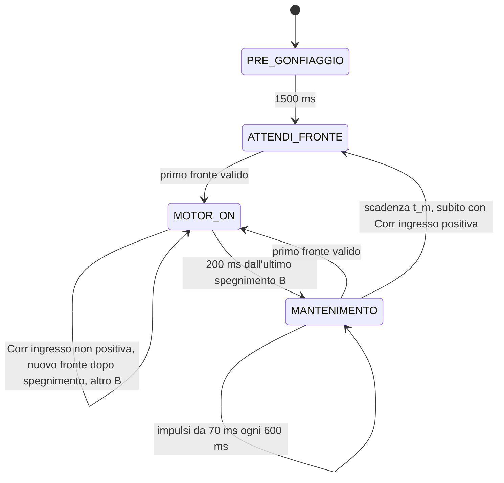

# Freno pneumatico — Arduino Nano Every

Il firmware e' in `sketchbook/FrenoPneumatico/FrenoPneumatico.ino`.
Ogni stato ha una parte **ONCE**, eseguita all'ingresso, e una parte
**ALWAYS**, eseguita a ogni loop. L'ISR legge e filtra l'encoder e copia il
livello grezzo su PE1. Timer, transizioni e uscite motore sono nel main loop.

## Sequenza



| Stato | ONCE | ALWAYS |
| --- | --- | --- |
| `PRE_GONFIAGGIO` | Azzera campioni e correzione; accende il motore | Dopo 1500 ms passa a `ATTENDI_FRONTE` |
| `ATTENDI_FRONTE` | Spegne il motore | Al primo fronte passa a `MOTOR_ON` |
| `MOTOR_ON` | Salva se il ciclo precedente ha eseguito mantenimenti; memorizza Dt, aggiorna Corr, sceglie Av, congela la modalita' recupero e inizia il nuovo n | Primo B immediato, oppure attende Av entro il limite di fronti; con Corr positiva un solo B da 100 ms; altrimenti altri B su nuovi fronti a motore spento; dopo 200 ms dall'ultimo spegnimento prepara il mantenimento |
| `MANTENIMENTO` | Calcola t_m; lo forza a zero se Corr era positiva all'ingresso in MOTOR_ON | Con t_m=0 passa subito a `ATTENDI_FRONTE`; altrimenti impulsi da 70 ms ogni 600 ms; al primo fronte torna a `MOTOR_ON`; a fine t_m passa a `ATTENDI_FRONTE` |
| `FERMO` | Spegne il motore | Attende il comando `a` |

Ogni transizione esegue il ONCE del nuovo stato nello stesso loop.
I fronti del pregonfiaggio vengono consumati, compreso quello osservato
nel loop che lo termina: serve un nuovo fronte dopo l'ingresso in attesa.

## Ritardo limitato del primo bloccaggio

All'ingresso in `MOTOR_ON`, il controllo aggiorna la correzione accumulata
prima di decidere quando generare il primo bloccaggio. L'attesa
si applica **solo con Corr positiva e nessun impulso di mantenimento
realmente avviato nel ciclo precedente**. Se il ciclo precedente ha eseguito
anche un solo mantenimento, il primo fronte accende subito il bloccaggio,
indipendentemente dal valore positivo di Corr. Anche il primo ciclo dopo
il pregonfiaggio parte subito, senza una storia precedente.

Il conteggio dei mantenimenti precedenti viene salvato prima di azzerare
i contatori del nuovo ciclo. Si usa `indiceMantenimento`, cioe' il numero
effettivamente avviato, anche se l'ultimo impulso e' interrotto dal fronte;
il numero nominale previsto nel campo M del log non decide l'attesa.

```text
Dt = ingresso MOTOR_ON attuale - ingresso MOTOR_ON precedente
Corr += Dt - n_precedente * MS_PER_FRONTE
ritarda = ciclo_precedente_valido && mantenimenti_avviati_precedenti == 0 && Corr > 0
Av = 1                                         se non ritarda
Av = 1 + min(ceil(Corr / MS_CORR_PER_FRONTE_ATTESO), MAX_FRONTI_RITARDO_BLOCCAGGIO)   se ritarda
recupero = Corr > 0
```

`MS_CORR_PER_FRONTE_ATTESO` vale inizialmente **600 ms**, come
`MS_PER_FRONTE`, ma puo' essere regolato separatamente. `Av` e' il numero
cumulativo di fronti necessario per la **prima** accensione del ciclo.
Il fronte che ha causato l'ingresso e' gia' il numero 1.
`MAX_FRONTI_RITARDO_BLOCCAGGIO` vale **2**: al massimo due fronti aggiuntivi,
quindi il primo B parte al secondo fronte per Corr fino a 600 ms e al
terzo quando la correzione supera 600 ms. Impostandolo a **1** si limita
l'attesa al secondo fronte. Non vengono aggiunte
attese crescenti quando Corr e' molto grande.

La tabella si applica quando il ciclo precedente **non ha avviato mantenimenti**:

| Corr all'ingresso | Limite 1 | Limite 2, predefinito |
| --- | --- | --- |
| Negativa o zero | Primo fronte, subito | Primo fronte, subito |
| Da 1 a 600 ms | Secondo fronte | Secondo fronte |
| Maggiore di 600 ms, anche 22675 ms | Secondo fronte | Terzo fronte |

`Av` resta invariato per tutto quel `MOTOR_ON`. Tutti i fronti in attesa
vengono contati; al raggiungimento della soglia il motore si accende nello
stesso loop che la osserva. Se piu' fronti erano gia' arrivati prima che il
main reagisse, vengono tutti contati e possono soddisfare subito Av.
Se la soglia non e' raggiunta, lo stato resta a motore spento: il timeout
parte soltanto dalla fine del primo bloccaggio effettivamente generato.

Un fronte durante un mantenimento gia' avviato fa entrare subito in
`MOTOR_ON` con Av=1. Se il motore e' HIGH, il nuovo bloccaggio mantiene HIGH
senza un passaggio LOW; se e' nella pausa, si accende nello stesso loop.
Questa regola vale anche dopo la fine della finestra, in `ATTENDI_FRONTE`,
se il ciclo ha eseguito mantenimenti. L'ISR non accende il motore.

Questa strategia permette al freno di muoversi prima della prima frenata
quando la sola fase di bloccaggio frena troppo e non vengono eseguiti
mantenimenti. Il maggiore n del ciclo contribuisce a ridurre
la correzione al prossimo ingresso. Non si azzera artificialmente Corr.
L'efficacia dipende dalla risposta fisica: il limite dei fronti evita
attese troppo lunghe, ma non garantisce il recupero della correzione.

## Bloccaggi e modalita' recupero

Ogni impulso dura `IMPULSO_BLOCCAGGIO_MS`, **100 ms** nel repository;
il valore rimane parametrico. Alla fine il motore si spegne e riparte
`MOTOR_ON_TIMEOUT_MS`, **200 ms**, dal suo spegnimento effettivo.

- I fronti durante HIGH vengono contati, senza prolungare l'impulso o
  accodare altre accensioni.
- Con **Corr positiva all'ingresso**, si genera **un solo B**. Tutti i
  fronti durante l'accensione e nei 200 ms successivi vengono contati,
  ma non riaccendono il motore e non retriggerano il timeout.
- Con **Corr zero o negativa all'ingresso**, un nuovo fronte a motore
  spento genera un altro B, senza cambiare Corr, Av o l'istante iniziale
  del ciclo. Ogni nuovo spegnimento retriggera i 200 ms.
- Un fronte osservato nel loop che spegne B viene consumato mentre
  il motore e' ancora acceso; serve un fronte successivo.
- In recupero, anche il fronte osservato esattamente alla scadenza viene
  contato nel ciclo corrente e consumato: il timeout termina e si resta
  in `ATTENDI_FRONTE` fino a un fronte successivo.
- Con Corr non positiva, un fronte a motore spento ha precedenza sulla
  scadenza dei 200 ms e genera il successivo B.

La modalita' e' fissata all'ingresso dal solo valore di Corr, anche se il
ciclo precedente ha eseguito mantenimenti. La condizione sul mantenimento
precedente serve soltanto per il ritardo iniziale Av.
Quando il timeout scade si prepara `MANTENIMENTO` e si congela il conteggio.
In recupero t_m e' zero: nello stesso loop si passa a `ATTENDI_FRONTE`,
senza ulteriori accensioni. Con i tempi iniziali, il timeout termina
**300 ms dopo l'avvio effettivo dell'unico B**: 100 ms HIGH e 200 ms LOW,
indipendentemente dai fronti ricevuti.

## Conteggi, tempi e mantenimento

Ogni fronte appartiene a un solo ciclo. Il primo fronte in mantenimento
o attesa appartiene al nuovo `MOTOR_ON`. `frontiMotorOn` comprende il
fronte iniziale, quelli in attesa di Av e quelli durante tutti i bloccaggi.
`Np` e' invece il conteggio congelato del MOTOR_ON precedente.
Al primo ciclo non c'e' un campione precedente: Dt, Np e Corr sono zero.

La correzione si aggiorna soltanto all'ingresso; resta invariata durante
l'attesa, i bloccaggi e il mantenimento. Si conserva il segno. Un errore
positivo la aumenta; un errore negativo la diminuisce.

**Se Corr e' positiva all'ingresso in MOTOR_ON, si esegue al massimo un
bloccaggio e il mantenimento e' inibito per tutto quel ciclo**, anche se il
ciclo precedente aveva mantenimenti e quindi il bloccaggio e' immediato.
La decisione e' salvata nell'unico flag `recuperoAttivo`: i fronti successivi
non la cambiano. Questo evita
che i fronti accumulati durante attesa e arresto generino una nuova fase
di mantenimento nello stesso ciclo. Con Corr zero o negativa, invece,
si usa la formula normale.

Alla fine del bloccaggio:

```text
On = ingresso MANTENIMENTO - ingresso MOTOR_ON
t_m = 0                                                 se recupero
t_m = max(n_attuale * MS_PER_FRONTE - On - Corr, 0)        altrimenti
```

`On` e' il tempo completo nello stato: **attesa di Av, accensioni,
pause e timeout finale**. Non e' la somma dei tempi HIGH.
`tempoBloccaggioMs` mantiene quella somma come dato diagnostico.
`t_m` e' una finestra temporale dall'ingresso in mantenimento.

Il primo mantenimento parte all'ingresso se rimangono almeno 70 ms;
i successivi partono ogni **600 ms fra avvii**, quindi 70 ms HIGH e
530 ms LOW. Si avviano soltanto impulsi completi che terminano entro t_m:

```text
M = 0, se t_m < IMPULSO_MANTENIMENTO_MS
M = 1 + floor((t_m - IMPULSO_MANTENIMENTO_MS) / INTERVALLO_MANTENIMENTO_MS), altrimenti
```

Alla scadenza si passa ad `ATTENDI_FRONTE`; se t_m e' zero il passaggio
e' immediato. Un fronte encoder ha precedenza su tutte le scadenze e
riavvia `MOTOR_ON` nel main loop. Con loop in ritardo si conservano almeno
600 ms fra gli avvii effettivi, evitando raffiche di recupero; possono
essere eseguiti meno mantenimenti di quelli nominali.

`Dt` e `On` partono dall'ingresso causato dal primo fronte del ciclo,
anche se B parte piu' tardi. I timestamp del log `t` partono invece dal
**primo B effettivo**: per questo la sua riga conserva t=0. `d` misura
la distanza fra avvii effettivi, anche se qualche riga viene persa.

Esempio con Corr=600 ms e nessun mantenimento nel ciclo precedente: Av=2.
Se il secondo fronte arriva 100 ms dopo l'ingresso, B parte allora;
si spegne a 200 ms e il timeout termina a 400 ms. Con n=2 la formula normale
darebbe 1200-400-600=200 ms di mantenimento. Poiche' Corr era positiva,
si forza invece t_m=0: il riepilogo mostra `On:400 Tm:0 M:0` e si attende
il prossimo fronte. Tutti i fronti restano contati per la correzione
al prossimo ingresso. Il mantenimento torna disponibile nel primo ciclo
che entra con Corr zero o negativa.

## Coerenza e limiti

La correzione accumulata regola la cadenza media. L'avvio e il mantenimento
sono discreti, quindi possono produrre cicli alternati intorno all'obiettivo.
L'obiettivo e' **600 ms per fronte accettato**; CHANGE conta salita e
discesa, se entrambi superano il filtro.

Con carichi bassi che non richiedono mantenimenti, aspettare uno o due
fronti aggiuntivi puo' aiutare a recuperare una correzione positiva senza
ripetere la prima frenata troppo presto. Il recupero dipende dai fronti e dalla risposta fisica effettivi:
se il freno libero genera fronti piu' lentamente dell'obiettivo, il
controllo non puo' crearne di aggiuntivi. Senza nuovi fronti durante
l'attesa di Av, il motore resta spento. Se anche il solo bloccaggio
trattiene troppo a lungo il freno, Corr puo' continuare a crescere nonostante
il mantenimento sia assente. Questa prova non cambia la durata dei B.

I calcoli usano 64 bit con segno; Corr e' limitata al campo numerico
`-UINT32_MAX..UINT32_MAX` ms, t_m a `0..UINT32_MAX` ms e Av a 3,
oppure 2 quando il limite e' configurato a un fronte aggiuntivo.
I timer e il conteggio supportano il rollover con intervalli inferiori
a un giro completo. Non viene ripristinato il vecchio limite di richiesta
motore a 2000 ms.

## Parametri

| Parametro | Valore iniziale | Significato |
| --- | --- | --- |
| `PRE_GONFIAGGIO_MS` | 1500 | Accensione iniziale |
| `MOTOR_ON_TIMEOUT_MS` | 200 | Attesa dall'ultimo spegnimento B |
| `IMPULSO_BLOCCAGGIO_MS` | 100 | Durata di ogni B |
| `IMPULSO_MANTENIMENTO_MS` | 70 | Durata di ogni mantenimento |
| `INTERVALLO_MANTENIMENTO_MS` | 600 | Distanza fra avvii di mantenimento |
| `MS_PER_FRONTE` | 600 | Cadenza media obiettivo |
| `MS_CORR_PER_FRONTE_ATTESO` | 600 | Correzione per ogni fronte aggiuntivo prima di B, solo senza mantenimenti precedenti |
| `MAX_FRONTI_RITARDO_BLOCCAGGIO` | 2 | Limite di fronti aggiuntivi prima del primo B; valori consentiti 1 o 2 |
| `ENCODER_HOLDOFF_US` | 2000 | Tempo minimo fra fronti accettati |

## Collegamenti e ISR

| Segnale | Pin | Configurazione |
| --- | --- | --- |
| Preimpostazione | D11 | HIGH |
| Preimpostazione | D6 | HIGH |
| Preimpostazione | D4 | LOW |
| Comando pompa | D3 | HIGH acceso, LOW spento |
| Encoder | D14 / A0 | INPUT, senza pull-up, interrupt CHANGE |
| Debug encoder | D12 / PE1 | OUTPUT, copia del livello grezzo encoder |
| Ingresso aggiuntivo | PD6 | INPUT, buffer digitale attivo, senza pull-up o interrupt |
| Ingresso aggiuntivo | PA6 | INPUT, buffer digitale attivo, senza pull-up o interrupt |

In `setup()` ogni pin Arduino viene configurato con `pinMode()` prima di
`digitalWrite()`, come richiesto dal core megaAVR per D11 e D6 HIGH.
PD6 e PA6 vengono configurati direttamente con `DIRCLR = PIN6_bm` e
`PIN6CTRL = 0`, anche se non sono mappati dalla variante Arduino Nano Every.

L'ISR copia subito A0 su PE1, prima del filtro: il debug mostra anche i
rimbalzi. Il primo fronte e' accettato, anche a `micros() = 0`; dopo un
fronte valido quelli a meno di 2 ms vengono scartati. A 2 ms esatti il
nuovo fronte e' valido. I rimbalzi scartati non prolungano il holdoff.
Si contano salita e discesa: un impulso alto/basso vale due fronti se
entrambi passano il filtro. L'encoder deve fornire livelli definiti e
compatibili, con massa comune alla scheda.

L'ISR incrementa soltanto `encoderTotale` dopo il filtro: non conosce lo
stato della macchina, non imposta richieste motore e non esegue log.
`leggiEncoder()` usa `ATOMIC_BLOCK(ATOMIC_RESTORESTATE)` per leggere insieme
i 32 bit del contatore sul microcontrollore a 8 bit, ripristinando poi lo
stato degli interrupt. La macchina a stati rileva i fronti confrontando
questo campione con quello gia' letto nel main loop.

## Log e comandi seriali

Monitor seriale a **115200 baud**. All'alimentazione o reset si stampa
`Avvio freno - Corr>0: un solo bloccaggio, niente mantenimento`, seguito
dal valore del ritardo massimo e dalla legenda dei campi.
Questo testo permette di riconoscere il firmware caricato. La legenda
riporta **un campo per riga**; tutti i tempi sono in ms e Corr viene sempre
stampata con segno, positiva, zero o negativa:

```text
Dt : delta t tra ingressi MOTOR_ON successivi
Np : fronti contati nel MOTOR_ON precedente
Corr : correzione accumulata, sempre con segno + o -
Av : numero del fronte che avvia il primo bloccaggio
B : numero dell'impulso di bloccaggio nel ciclo
Imp : durata dell'impulso di bloccaggio
Fr : fronti contati nel MOTOR_ON attuale
On : tempo totale in MOTOR_ON, incluse attesa e pause
Tm : durata della finestra di mantenimento
M : numero di impulsi di mantenimento previsti
M:k/N : mantenimento avviato k su N previsti
t : tempo dall'avvio del primo bloccaggio del ciclo
d : distanza tra avvii di impulsi consecutivi
s : arresta il controllo
a : da fermo riavvia con pregonfiaggio
```

I comandi funzionano con o senza terminazione di riga:

| Comando | Effetto |
| --- | --- |
| `s` | Passa a `FERMO` e spegne il motore nello stesso loop |
| `a` | Da `FERMO`, riparte con pregonfiaggio e correzione azzerata |

`a` durante una prova attiva e' ignorato. Una nuova prova cancella i
campioni della precedente, senza ristampare `Avvio freno`. La lettura dei
comandi e' limitata a otto caratteri per loop. Non si usa `delay()`.

Il log di un ciclo senza attesa iniziale, con tre bloccaggi e n=3, e':

```text
B:1 Imp:100 Fr:    1 t:         0 d:         0
Dt:         0 Np:    0 Corr:+0 Av:1
B:2 Imp:100 Fr:    2 t:       120 d:       120
B:3 Imp:100 Fr:    3 t:       240 d:       120
Fr:    3 On:   540 Tm:  1260 M:2
M:1/2 t:       540 d:       300
M:2/2 t:      1140 d:       600
```

| Campo | Significato |
| --- | --- |
| `Dt` | Tempo fra ingressi in MOTOR_ON, al primo fronte del ciclo |
| `Np` | Fronti del MOTOR_ON precedente |
| `Corr` | Correzione accumulata con segno, aggiornata all'ingresso |
| `Av` | Fronte cumulativo richiesto per il primo B |
| `B` | Numero dell'accensione di bloccaggio |
| `Imp` | Durata HIGH parametrica del bloccaggio |
| `Fr` | Fronti attuali sulla riga B; fronti finali sul riepilogo |
| `On` | Tempo completo in MOTOR_ON, anche durante l'attesa e LOW |
| `Tm` | Finestra temporale di mantenimento |
| `M` | Numero nominale di mantenimenti previsti |
| `M:k/N` | Mantenimento realmente avviato k, su N nominalmente previsti |
| `t` | Tempo dal primo B effettivo, che vale zero sulla prima riga B |
| `d` | Distanza fra avvii effettivi; sul primo B vale zero |

Dt, Np, Corr e Av si stampano una sola volta all'ingresso. Quando Av>1,
questa riga compare prima di B, mentre il motore aspetta i fronti.
I mantenimenti non ripetono la correzione.
Con Corr positiva nel log d'ingresso, il riepilogo di quel ciclo deve
mostrare sempre `Tm:0 M:0`, anche se Fr e' elevato, e puo' esserci soltanto
`B:1`. Il numero di fronti include quelli ricevuti nella pausa del timeout.
Con il limite iniziale di due fronti aggiuntivi, Av puo' valere 1, 2 o 3.
Se il ciclo precedente ha avviato almeno un mantenimento, deve valere Av=1.

Le righe vengono accodate in una coda di **quattro righe da massimo 63
caratteri**. Alla fine del loop, dopo uscite e timer, la UART invia solo
righe intere che entrano nello spazio disponibile. Se B riempie la UART,
Corr rimane in coda per un loop successivo invece di essere scartata.
Non si attende la seriale. Con congestione prolungata che riempie anche
la coda, le nuove righe vengono saltate interamente; i log non alterano
accensioni, timer o conteggi. Il testo di avvio si stampa solo in setup.

## Struttura e verifiche

```text
GIN/
├── README.md
├── sketchbook/
│   └── FrenoPneumatico/
│       └── FrenoPneumatico.ino
└── tests/
    ├── controller_test.cpp
    └── mock/
        ├── Arduino.h
        └── util/atomic.h
```

Usare `GIN` come repository locale e `GIN/sketchbook` come posizione
sketchbook nell'IDE Arduino. Il nome del file e quello della cartella
coincidono. Installare **Arduino megaAVR Boards**, scegliere **Arduino
Nano Every** e **Registers emulation: None (ATMEGA4809)**.

```sh
arduino-cli compile --fqbn arduino:megaavr:nona4809:mode=off sketchbook/FrenoPneumatico
```

Nel cloud si usa `/workspace/.tools/arduino/compile-nano-every.sh`.
Le verifiche comprendono anche la compilazione con `build.mcu=atmega3209`.
La toolchain cloud e' Arduino CLI 1.4.1, megaAVR 1.8.8, API 1.3.1 e AVR GCC
Debian 14.2.0, diverso dal compilatore del pacchetto Arduino standard.
Il caricamento USB non e' verificato.

## Prova sul prototipo

Iniziare con `MAX_FRONTI_RITARDO_BLOCCAGGIO = 2`, B da 100 ms,
mantenimenti da 70 ms ogni 600 ms e timeout da 200 ms.

1. Al reset verificare il marcatore di avvio e `Ritardo massimo (fronti aggiuntivi): 2`.
2. Registrare 20-30 cicli a carico basso: Corr positiva deve dare sempre
   un solo `B:1` e `Tm:0 M:0`; Av=2 o Av=3 soltanto dopo un ciclo senza mantenimenti.
3. Provare un carico maggiore e poi variare il carico: tutti i fronti
   devono essere contati; i B successivi e il mantenimento tornano
   disponibili quando Corr all'ingresso e' zero o negativa. Dopo un ciclo
   che ha avviato mantenimenti, il primo B deve partire subito con Av=1,
   anche se Corr e' positiva.
4. Valutare la cadenza media con `somma(Dt) / somma(Np)`, escludendo la
   prima riga senza campione precedente, e osservare l'andamento di Corr.
   Se Corr continua a crescere con M=0, il limite di ritardo non e' sufficiente
   a compensare la frenata di bloccaggio.

Per confrontare il limite 1, cambiare soltanto quel parametro e ripetere
la stessa prova. Non vengono modificati automaticamente gli altri tempi.

## Test simulati

I **52 gruppi di test** simulati coprono GPIO, ISR, filtro/holdoff,
ONCE/ALWAYS, bloccaggi e timeout, conteggi separati, mantenimento regolare
e interrompibile, formule e limiti, rollover, stop/riavvio e UART.
Le verifiche dell'avvio limitato comprendono le soglie positive,
zero e negative, il secondo/terzo fronte, i valori Corr del log riportato,
assenza di timeout prima del primo B, fronti accumulati prima del main,
bloccaggio immediato dopo mantenimenti completati o interrotti anche con
Corr positiva elevata, conteggio reale distinto dal numero nominale,
inibizione del mantenimento anche dopo numerosi fronti nello stesso ciclo,
ritorno al mantenimento quando Corr diventa zero o negativa, reset
della modalita' recupero dopo stop/riavvio, un solo B con Corr positiva
anche dopo un ciclo con mantenimenti, conteggio dei fronti a motore spento,
assenza di retrigger e di riavvio al fronte coincidente con il timeout,
bloccaggi multipli con Corr non positiva e tempi del log.
Gli stessi 52 gruppi sono stati eseguiti con B da 100 ms e mantenimenti
da 70 ms, sia con il limite predefinito 2 sia su una copia dello sketch
con limite di un fronte aggiuntivo. La legenda viene verificata
con un campo per riga.
La UART viene simulata anche mentre si riempie: Corr negativa resta in
coda dopo B e viene emessa appena c'e' spazio; la coda piena non blocca
il controllo e non sovrascrive le righe pendenti.

Il modello con quattro fronti per movimento e rilascio dopo 800 ms misura
**597,75 ms per fronte** su 100 cicli, con Corr finale di -900 ms.
Il modello a basso carico, con un fronte ogni 100 ms a freno libero e
rilascio 3000 ms dopo LOW, mostra invece il limite della proposta:
su 300 cicli misura **1605,47 ms per fronte** con limite 1 e **1104,77 ms**
con limite 2. Corr continua a crescere, rispettivamente fino a 601270 e
452270 ms, mentre il mantenimento rimane inibito. Con quella risposta
fisica il solo bloccaggio trattiene troppo a lungo per raggiungere 600 ms
per fronte usando al massimo due fronti aggiuntivi. Il test registra questa
limitazione, senza richiedere una convergenza che l'algoritmo non produce.
Sono modelli idealizzati; la risposta e la stabilita' del prototipo reale
richiedono la prova hardware.

```sh
set -e
mkdir -p /tmp/gin-tests
g++ -std=c++11 -Wall -Wextra -Werror -pedantic \
  -fsanitize=address,undefined -I tests/mock tests/controller_test.cpp \
  -o /tmp/gin-tests/controller_test
ASAN_OPTIONS=detect_leaks=0 /tmp/gin-tests/controller_test
```

I file `tests/mock/Arduino.h` e `tests/mock/util/atomic.h` servono soltanto
alla simulazione sul PC: non vanno copiati nello sketch e non simulano la
concorrenza reale degli ISR. AddressSanitizer e UndefinedBehaviorSanitizer
rimangono attivi; `detect_leaks=0` evita i limiti di LeakSanitizer sotto
`ptrace`. La risposta pneumatica e l'arresto reale vanno verificati sul prototipo.
