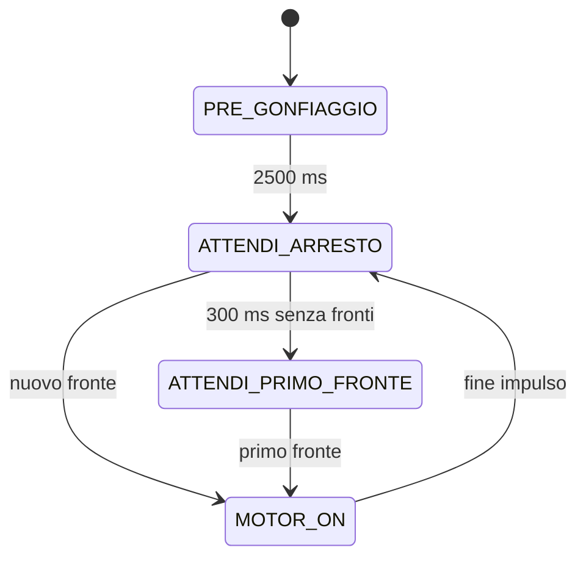

# Freno pneumatico — macchina a stati su Arduino Nano Every

Tutto il firmware e' in `sketchbook/FrenoPneumatico/FrenoPneumatico.ino`.
Ogni stato contiene una parte **ONCE**, eseguita all'ingresso, e una parte
**ALWAYS**, eseguita a ogni loop. Il timer del motore e la correzione della
sua durata vengono impostati solo nel ONCE di `MOTOR_ON`.

## Sequenza



| Stato | ONCE: all'ingresso | ALWAYS: a ogni loop |
| --- | --- | --- |
| `PRE_GONFIAGGIO` | Ripristina la prova; accende la pompa | Dopo 2500 ms passa ad attesa arresto |
| `ATTENDI_ARRESTO` | Spegne la pompa; avvia il timeout | Un fronte avvia un impulso; 300 ms senza fronti confermano l'arresto |
| `ATTENDI_PRIMO_FRONTE` | Mantiene la pompa spenta | Aspetta il primo fronte dopo l'arresto |
| `MOTOR_ON` | Corregge la durata; campiona tempo e contatore; accende la pompa | Conta i fronti senza prolungare il timer; alla scadenza torna ad attesa arresto |
| `FERMO` | Spegne la pompa | Aspetta il comando di riavvio |

Una transizione esegue subito il ONCE del nuovo stato, nello stesso loop.
All'avvio il pregonfiaggio dura 2,5 secondi. Si passa poi a `ATTENDI_ARRESTO`,
anche se non sono arrivati fronti, per osservare un intero timeout di silenzio.

Ogni fronte rilevato in `ATTENDI_ARRESTO` fa entrare in `MOTOR_ON`: possono
quindi esserci piu' impulsi prima dell'arresto. I fronti arrivati durante un
motor-on vengono contati, ma non riavviano il timer e non accodano impulsi.
Il primo impulso ha durata 200 ms. Alla sua scadenza la pompa si spegne e
parte una nuova attesa di 300 ms senza fronti, misurata dallo spegnimento.
Quando scade il timeout, il controllo aspetta il primo fronte del nuovo scatto.

Il blocco e' **presunto dal silenzio dell'encoder**. Il timeout di 300 ms e'
una scelta iniziale da verificare sulla meccanica; non misura la pressione
ne' uno spostamento piu' piccolo della risoluzione dell'encoder.

## Correzione della durata motor-on

A ogni ingresso in `MOTOR_ON` si campionano il tempo corrente e il contatore
encoder cumulativo. Dal secondo ingresso si calcolano sullo stesso intervallo:

```text
T = tempo motor-on attuale - tempo motor-on precedente
n = contatore attuale - contatore al motor-on precedente
obiettivo = n * 600 ms

T > obiettivo  -> durata motor-on diminuisce di 20 ms
T < obiettivo  -> durata motor-on aumenta di 20 ms
T = obiettivo  -> durata motor-on invariata
```

La durata resta tra **20 e 400 ms**. Questi sono limiti temporali modificabili
nel sorgente. La correzione si esegue una volta all'ingresso di `MOTOR_ON`;
la nuova durata viene usata subito per quell'impulso.

`T` e' misurato tra gli avvii del motore, non tra i timestamp dei fronti.
Il campione `n` include tutti i fronti successivi al campione del precedente
motor-on, durante accensione e attesa, compreso il fronte che attiva il nuovo
motor-on. Il fronte che aveva attivato l'accensione precedente e' gia' nel
campione iniziale e non viene contato nuovamente. I fronti del pregonfiaggio
non influenzano la correzione: il primo motor-on registra soltanto la base.

Esempio: con 4 fronti tra due motor-on, il confronto e' con 2400 ms.
Un periodo di 2401 ms porta la durata da 200 a 180 ms; 2399 ms la porta a
220 ms; 2400 ms la lascia invariata. Contatore e `millis()` usano sottrazioni
unsigned, per gestire il loro rollover.

## Parametri e struttura locale

I parametri sono all'inizio del `.ino`:

| Parametro | Valore iniziale | Significato |
| --- | --- | --- |
| `PRE_GONFIAGGIO_MS` | 2500 | Accensione iniziale |
| `TIMEOUT_ARRESTO_MS` | 300 | Silenzio dopo lo spegnimento per arresto presunto |
| `MS_PER_FRONTE` | 600 | Tempo obiettivo per ciascun fronte |
| `IMPULSO_INIZIALE_MS` | 200 | Primo motor-on di controllo |
| `PASSO_MS` | 20 | Correzione della durata per intervallo |
| `IMPULSO_MINIMO_MS` | 20 | Durata minima |
| `IMPULSO_MASSIMO_MS` | 400 | Durata massima |

```text
GIN/
├── README.md
├── sketchbook/
│   └── FrenoPneumatico/
│       └── FrenoPneumatico.ino
└── tests/
    ├── controller_test.cpp
    └── mock/
        ├── Arduino.h
        └── util/
            └── atomic.h
```

Usare `GIN` come repository locale. Nelle preferenze dell'IDE Arduino,
impostare **Posizione sketchbook** su `GIN/sketchbook`, oppure aprire il `.ino`
direttamente. La cartella dello sketch e il file principale hanno lo stesso
nome, come richiesto da Arduino. Installare **Arduino megaAVR Boards**,
scegliere **Arduino Nano Every** e **Registers emulation: None (ATMEGA4809)**.

## Collegamenti e seriale

| Segnale | Pin | Configurazione |
| --- | --- | --- |
| Preimpostazione | D11 | HIGH |
| Preimpostazione | D6 | HIGH |
| Preimpostazione | D4 | LOW |
| Comando pompa | D3 | HIGH acceso, LOW spento |
| Encoder | D14 / A0 | INPUT, senza pull-up interno, interrupt CHANGE |

Si contano salita e discesa: un impulso completo alto/basso vale due fronti.
L'encoder deve fornire livelli definiti e compatibili, con massa comune alla
scheda. D3 comanda lo stadio di potenza del motore.

All'alimentazione o reset parte automaticamente il pregonfiaggio.
Monitor seriale a **115200 baud**, con o senza terminazione di riga:

| Comando | Effetto |
| --- | --- |
| `s` | Passa a `FERMO` e spegne la pompa nello stesso loop |
| `a` | Da `FERMO`, riparte con pregonfiaggio e durata iniziale di 200 ms |

`a` durante una prova attiva viene ignorato. Una nuova prova cancella i
campioni della precedente. Le operazioni usano `millis()`, senza `delay()`.

Il log, una riga al secondo se il buffer ha spazio, e':

```text
S,stato,P,durata_motor_on_ms,N,fronti_periodo,T,periodo_ms
```

Stati: 0=pregonfiaggio, 1=attesa arresto, 2=attesa primo fronte,
3=motor-on, 4=fermo. `N` e `T` descrivono lo stesso ultimo intervallo completato
tra due motor-on; valgono 0 fino al secondo motor-on. `P` e' la durata corretta
dell'impulso di controllo, anche durante il pregonfiaggio da 2500 ms.

## Lettura atomica e verifiche

L'interrupt incrementa soltanto `encoderTotale`. La lettura usa
`ATOMIC_BLOCK(ATOMIC_RESTORESTATE)` della toolchain AVR: protegge la copia
a 32 bit sul microcontrollore a 8 bit e ripristina lo stato degli interrupt.
`tests/mock/util/atomic.h` e `tests/mock/Arduino.h` servono solo ai test PC,
non vanno copiati nello sketch e non verificano la concorrenza reale degli ISR.

Dalla radice del repository, con il core installato:

```sh
arduino-cli compile --fqbn arduino:megaavr:nona4809:mode=off sketchbook/FrenoPneumatico
```

Nel cloud:

```sh
/workspace/.tools/arduino/compile-nano-every.sh
```

La compilazione cloud usa Arduino CLI 1.4.1, megaAVR 1.8.8, API 1.3.1 e
AVR GCC Debian 14.2.0, diverso da quello del pacchetto Arduino standard.
Gli indici remoti e i tool di discovery non disponibili non impediscono
la compilazione con il core locale. Il caricamento USB non e' verificato.

I test verificano 13 gruppi: avvio/pin, ONCE, movimento dopo pregonfiaggio,
nuovi impulsi durante l'attesa, correzione e conteggio, timestamp motor-on,
moto continuo, minimo, massimo, stop/riavvio, rollover del tempo e del
contatore, seriale congestionata.

```sh
set -e
mkdir -p /tmp/gin-tests
g++ -std=c++11 -Wall -Wextra -Werror -pedantic \
  -fsanitize=address,undefined -I tests/mock tests/controller_test.cpp \
  -o /tmp/gin-tests/controller_test
/tmp/gin-tests/controller_test
```

Se LeakSanitizer non puo' funzionare sotto `ptrace`, usare
`ASAN_OPTIONS=detect_leaks=0`: rimangono attivi AddressSanitizer e
UndefinedBehaviorSanitizer. I test simulati verificano il firmware; la
risposta pneumatica e il tempo reale di arresto vanno osservati sul prototipo.
