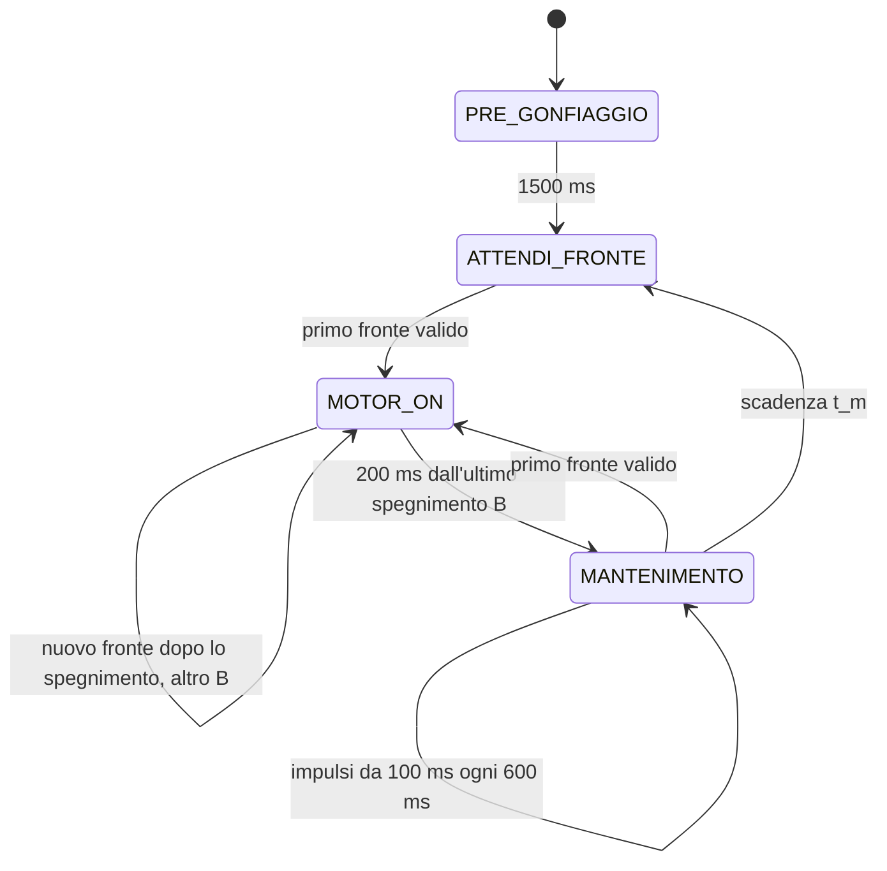

# Freno pneumatico — Arduino Nano Every

Il firmware e' in `sketchbook/FrenoPneumatico/FrenoPneumatico.ino`.
Ogni stato ha una parte **ONCE**, eseguita all'ingresso, e una parte
**ALWAYS**, eseguita a ogni loop. L'ISR legge e filtra l'encoder e copia il
livello grezzo su PE1. Timer, transizioni e uscite motore sono nel main loop.

## Sequenza



| Stato | ONCE | ALWAYS |
| --- | --- | --- |
| `PRE_GONFIAGGIO` | Azzera campioni e correzione; accende il motore | Dopo 1500 ms passa a `ATTENDI_FRONTE` |
| `ATTENDI_FRONTE` | Spegne il motore | Al primo fronte passa a `MOTOR_ON` |
| `MOTOR_ON` | Memorizza Dt, aggiorna Corr, sceglie Av e inizia il nuovo n | Aspetta Av a motore spento; poi genera bloccaggi da 150 ms; dopo 200 ms dall'ultimo spegnimento passa al mantenimento |
| `MANTENIMENTO` | Calcola t_m dal nuovo n e dal tempo completo in MOTOR_ON | Impulsi da 100 ms ogni 600 ms; al primo fronte torna a `MOTOR_ON`; a fine t_m passa a `ATTENDI_FRONTE` |
| `FERMO` | Spegne il motore | Attende il comando `a` |

Ogni transizione esegue il ONCE del nuovo stato nello stesso loop.
I fronti del pregonfiaggio vengono consumati, compreso quello osservato
nel loop che lo termina: serve un nuovo fronte dopo l'ingresso in attesa.

## Primo bloccaggio proporzionale alla correzione

All'ingresso in `MOTOR_ON`, il controllo aggiorna la correzione accumulata
prima di decidere quando generare il primo bloccaggio:

```text
Dt = ingresso MOTOR_ON attuale - ingresso MOTOR_ON precedente
Corr += Dt - n_precedente * MS_PER_FRONTE
Av = 1                              se Corr <= 0
Av = 1 + ceil(Corr / MS_CORR_PER_FRONTE_ATTESO)   se Corr > 0
```

`MS_CORR_PER_FRONTE_ATTESO` vale inizialmente **600 ms**, come
`MS_PER_FRONTE`, ma puo' essere regolato separatamente. `Av` e' il numero
cumulativo di fronti necessario per la **prima** accensione del ciclo.
Il fronte che ha causato l'ingresso e' gia' il numero 1.

| Corr all'ingresso | Primo bloccaggio |
| --- | --- |
| Negativa o zero | Primo fronte, subito nel main loop |
| Da 1 a 600 ms | Secondo fronte |
| Da 601 a 1200 ms | Terzo fronte |
| 1400 ms | Quarto fronte |
| 22675 ms | 39esimo fronte |
| 23336 ms | 40esimo fronte |
| 23789 ms | 41esimo fronte |

`Av` resta invariato per tutto quel `MOTOR_ON`. Tutti i fronti in attesa
vengono contati; al raggiungimento della soglia il motore si accende nello
stesso loop che la osserva. Se piu' fronti erano gia' arrivati prima che il
main reagisse, vengono tutti contati e possono soddisfare subito Av.
Se la soglia non e' raggiunta, lo stato resta a motore spento: il timeout
parte soltanto dalla fine del primo bloccaggio effettivamente generato.

Un fronte durante un mantenimento puo' far entrare in `MOTOR_ON` mentre
il motore e' HIGH. Se occorre aspettare Av, quel mantenimento viene spento
subito. Con Av=1 il nuovo bloccaggio mantiene HIGH senza un passaggio LOW.
L'ISR non accende il motore.

Questa strategia permette al freno di muoversi prima della prima frenata
quando Corr e' positiva. Il maggiore n del ciclo contribuisce a ridurre
la correzione al prossimo ingresso. Non si azzera artificialmente Corr.
La scelta del bloccaggio singolo e il campo S della versione precedente
sono stati sostituiti dall'avvio proporzionale, riconoscibile dal campo Av.

## Bloccaggi dopo il raggiungimento di Av

Ogni impulso dura `IMPULSO_BLOCCAGGIO_MS`, **150 ms** nel repository;
il valore rimane parametrico. Alla fine il motore si spegne e riparte
`MOTOR_ON_TIMEOUT_MS`, **200 ms**, dal suo spegnimento effettivo.

- I fronti durante HIGH vengono contati, senza prolungare l'impulso o
  accodare altre accensioni.
- Un nuovo fronte a motore spento genera un altro B, senza cambiare
  Corr, Av o l'istante iniziale del ciclo.
- Un fronte osservato nel loop che spegne B viene consumato mentre
  il motore e' ancora acceso; serve un fronte successivo.
- Un fronte a motore spento ha precedenza sulla scadenza dei 200 ms.

Dopo il primo B, quindi, possono esserci altri bloccaggi anche con Corr
positiva: il ritardo proporzionale riguarda il loro **avvio iniziale**.
Quando il timeout scade senza nuovi fronti a motore spento, si passa a
`MANTENIMENTO` e il conteggio del ciclo viene congelato.

## Conteggi, tempi e mantenimento

Ogni fronte appartiene a un solo ciclo. Il primo fronte in mantenimento
o attesa appartiene al nuovo `MOTOR_ON`. `frontiMotorOn` comprende il
fronte iniziale, quelli in attesa di Av e quelli durante tutti i bloccaggi.
`Np` e' invece il conteggio congelato del MOTOR_ON precedente.
Al primo ciclo non c'e' un campione precedente: Dt, Np e Corr sono zero.

La correzione si aggiorna soltanto all'ingresso; resta invariata durante
l'attesa, i bloccaggi e il mantenimento. Si conserva il segno. Un errore
positivo la aumenta; un errore negativo la diminuisce.

Alla fine del bloccaggio:

```text
On = ingresso MANTENIMENTO - ingresso MOTOR_ON
t_m = max(n_attuale * MS_PER_FRONTE - On - Corr, 0)
```

`On` e' il tempo completo nello stato: **attesa di Av, accensioni,
pause e timeout finale**. Non e' la somma dei tempi HIGH.
`tempoBloccaggioMs` mantiene quella somma come dato diagnostico.
`t_m` e' una finestra temporale dall'ingresso in mantenimento.

Il primo mantenimento parte all'ingresso se rimangono almeno 100 ms;
i successivi partono ogni **600 ms fra avvii**, quindi 100 ms HIGH e
500 ms LOW. Si avviano soltanto impulsi completi che terminano entro t_m:

```text
M = 0, se t_m < IMPULSO_MANTENIMENTO_MS
M = 1 + floor((t_m - IMPULSO_MANTENIMENTO_MS) / INTERVALLO_MANTENIMENTO_MS), altrimenti
```

Alla scadenza si passa ad `ATTENDI_FRONTE`; se t_m e' zero il passaggio
e' immediato. Un fronte encoder ha precedenza su tutte le scadenze e
riavvia `MOTOR_ON` nel main loop. Con loop in ritardo si conservano almeno
600 ms fra gli avvii effettivi, evitando raffiche di recupero; possono
essere eseguiti meno mantenimenti di quelli nominali.

`Dt` e `On` partono dall'ingresso causato dal primo fronte del ciclo,
anche se B parte piu' tardi. I timestamp del log `t` partono invece dal
**primo B effettivo**: per questo la sua riga conserva t=0. `d` misura
la distanza fra avvii effettivi, anche se qualche riga viene persa.

Esempio con Corr=600 ms: Av=2. Se il secondo fronte arriva 100 ms dopo
l'ingresso, B parte allora; si spegne a 250 ms e il timeout termina a
450 ms. Con n=2, t_m=1200-450-600=150 ms e M=1. Il mantenimento parte
450 ms dall'ingresso, ma il suo log mostra t=350 ms dal primo B.

## Coerenza e limiti

La correzione accumulata regola la cadenza media. L'avvio e il mantenimento
sono discreti, quindi possono produrre cicli alternati intorno all'obiettivo.
L'obiettivo e' **600 ms per fronte accettato**; CHANGE conta salita e
discesa, se entrambi superano il filtro.

Con carichi bassi, aspettare piu' fronti permette di recuperare una
correzione positiva senza ripetere continuamente la prima frenata troppo
presto. Il recupero dipende dai fronti e dalla risposta fisica effettivi:
se il freno libero genera fronti piu' lentamente dell'obiettivo, il
controllo non puo' crearne di aggiuntivi. Senza nuovi fronti durante
l'attesa di Av, il motore resta spento.

I calcoli usano 64 bit con segno; Corr e' limitata al campo numerico
`-UINT32_MAX..UINT32_MAX` ms, t_m a `0..UINT32_MAX` ms e Av a UINT32_MAX.
I timer e il conteggio supportano il rollover con intervalli inferiori
a un giro completo. Non viene ripristinato il vecchio limite di richiesta
motore a 2000 ms.

## Parametri

| Parametro | Valore iniziale | Significato |
| --- | --- | --- |
| `PRE_GONFIAGGIO_MS` | 1500 | Accensione iniziale |
| `MOTOR_ON_TIMEOUT_MS` | 200 | Attesa dall'ultimo spegnimento B |
| `IMPULSO_BLOCCAGGIO_MS` | 150 | Durata di ogni B |
| `IMPULSO_MANTENIMENTO_MS` | 100 | Durata di ogni mantenimento |
| `INTERVALLO_MANTENIMENTO_MS` | 600 | Distanza fra avvii di mantenimento |
| `MS_PER_FRONTE` | 600 | Cadenza media obiettivo |
| `MS_CORR_PER_FRONTE_ATTESO` | 600 | Correzione per ogni fronte aggiuntivo prima di B |
| `ENCODER_HOLDOFF_US` | 2000 | Tempo minimo fra fronti accettati |

## Collegamenti e ISR

| Segnale | Pin | Configurazione |
| --- | --- | --- |
| Preimpostazione | D11 | HIGH |
| Preimpostazione | D6 | HIGH |
| Preimpostazione | D4 | LOW |
| Comando pompa | D3 | HIGH acceso, LOW spento |
| Encoder | D14 / A0 | INPUT, senza pull-up, interrupt CHANGE |
| Debug encoder | D12 / PE1 | OUTPUT, copia del livello grezzo encoder |
| Ingresso aggiuntivo | PD6 | INPUT, buffer digitale attivo, senza pull-up o interrupt |
| Ingresso aggiuntivo | PA6 | INPUT, buffer digitale attivo, senza pull-up o interrupt |

In `setup()` ogni pin Arduino viene configurato con `pinMode()` prima di
`digitalWrite()`, come richiesto dal core megaAVR per D11 e D6 HIGH.
PD6 e PA6 vengono configurati direttamente con `DIRCLR = PIN6_bm` e
`PIN6CTRL = 0`, anche se non sono mappati dalla variante Arduino Nano Every.

L'ISR copia subito A0 su PE1, prima del filtro: il debug mostra anche i
rimbalzi. Il primo fronte e' accettato, anche a `micros() = 0`; dopo un
fronte valido quelli a meno di 2 ms vengono scartati. A 2 ms esatti il
nuovo fronte e' valido. I rimbalzi scartati non prolungano il holdoff.
Si contano salita e discesa: un impulso alto/basso vale due fronti se
entrambi passano il filtro. L'encoder deve fornire livelli definiti e
compatibili, con massa comune alla scheda.

L'ISR incrementa soltanto `encoderTotale` dopo il filtro: non conosce lo
stato della macchina, non imposta richieste motore e non esegue log.
`leggiEncoder()` usa `ATOMIC_BLOCK(ATOMIC_RESTORESTATE)` per leggere insieme
i 32 bit del contatore sul microcontrollore a 8 bit, ripristinando poi lo
stato degli interrupt. La macchina a stati rileva i fronti confrontando
questo campione con quello gia' letto nel main loop.

## Log e comandi seriali

Monitor seriale a **115200 baud**. All'alimentazione o reset si stampa
`Avvio freno - avvio proporzionale`, seguito dalla legenda dei campi.
Questo testo permette di riconoscere il firmware caricato. La legenda
specifica che tutti i tempi sono in ms e Corr viene sempre stampata con
segno, positiva, zero o negativa. Con o senza terminazione di riga:

| Comando | Effetto |
| --- | --- |
| `s` | Passa a `FERMO` e spegne il motore nello stesso loop |
| `a` | Da `FERMO`, riparte con pregonfiaggio e correzione azzerata |

`a` durante una prova attiva e' ignorato. Una nuova prova cancella i
campioni della precedente, senza ristampare `Avvio freno`. La lettura dei
comandi e' limitata a otto caratteri per loop. Non si usa `delay()`.

Il log di un ciclo senza attesa iniziale, con tre bloccaggi e n=3, e':

```text
B:1 Imp:150 Fr:    1 t:         0 d:         0
Dt:         0 Np:    0 Corr:+0 Av:1
B:2 Imp:150 Fr:    2 t:       170 d:       170
B:3 Imp:150 Fr:    3 t:       340 d:       170
Fr:    3 On:   690 Tm:  1110 M:2
M:1/2 t:       690 d:       350
M:2/2 t:      1290 d:       600
```

| Campo | Significato |
| --- | --- |
| `Dt` | Tempo fra ingressi in MOTOR_ON, al primo fronte del ciclo |
| `Np` | Fronti del MOTOR_ON precedente |
| `Corr` | Correzione accumulata con segno, aggiornata all'ingresso |
| `Av` | Fronte cumulativo richiesto per il primo B |
| `B` | Numero dell'accensione di bloccaggio |
| `Imp` | Durata HIGH parametrica del bloccaggio |
| `Fr` | Fronti attuali sulla riga B; fronti finali sul riepilogo |
| `On` | Tempo completo in MOTOR_ON, anche durante l'attesa e LOW |
| `Tm` | Finestra temporale di mantenimento |
| `M` | Numero nominale di mantenimenti; M:k/N indica il progressivo |
| `t` | Tempo dal primo B effettivo, che vale zero sulla prima riga B |
| `d` | Distanza fra avvii effettivi; sul primo B vale zero |

Dt, Np, Corr e Av si stampano una sola volta all'ingresso. Quando Av>1,
questa riga compare prima di B, mentre il motore aspetta i fronti.
I mantenimenti non ripetono la correzione.

Le righe vengono accodate in una coda di **quattro righe da massimo 63
caratteri**. Alla fine del loop, dopo uscite e timer, la UART invia solo
righe intere che entrano nello spazio disponibile. Se B riempie la UART,
Corr rimane in coda per un loop successivo invece di essere scartata.
Non si attende la seriale. Con congestione prolungata che riempie anche
la coda, le nuove righe vengono saltate interamente; i log non alterano
accensioni, timer o conteggi. Il testo di avvio si stampa solo in setup.

Il log precedente riportato senza il campo S non coincide con la
versione 4e91b33, che inibiva i B successivi con Corr positiva e M=0 nel
ciclo precedente. Il marcatore di avvio e Av permettono di verificare
che sia stata caricata la nuova strategia. Anche nella vecchia versione
Corr aveva entrambi i segni, ma una riga poteva essere scartata per spazio
UART insufficiente.

## Struttura e verifiche

```text
GIN/
├── README.md
├── sketchbook/
│   └── FrenoPneumatico/
│       └── FrenoPneumatico.ino
└── tests/
    ├── controller_test.cpp
    └── mock/
        ├── Arduino.h
        └── util/atomic.h
```

Usare `GIN` come repository locale e `GIN/sketchbook` come posizione
sketchbook nell'IDE Arduino. Il nome del file e quello della cartella
coincidono. Installare **Arduino megaAVR Boards**, scegliere **Arduino
Nano Every** e **Registers emulation: None (ATMEGA4809)**.

```sh
arduino-cli compile --fqbn arduino:megaavr:nona4809:mode=off sketchbook/FrenoPneumatico
```

Nel cloud si usa `/workspace/.tools/arduino/compile-nano-every.sh`.
Le verifiche comprendono anche la compilazione con `build.mcu=atmega3209`.
La toolchain cloud e' Arduino CLI 1.4.1, megaAVR 1.8.8, API 1.3.1 e AVR GCC
Debian 14.2.0, diverso dal compilatore del pacchetto Arduino standard.
Il caricamento USB non e' verificato.

I **45 gruppi di test** simulati coprono GPIO, ISR, filtro/holdoff,
ONCE/ALWAYS, bloccaggi e timeout, conteggi separati, mantenimento regolare
e interrompibile, formule e limiti, rollover, stop/riavvio e UART.
Le verifiche dell'avvio proporzionale comprendono le soglie positive,
zero e negative, il secondo/terzo fronte, i valori Corr del log riportato,
assenza di timeout prima del primo B, fronti accumulati prima del main,
attesa durante il mantenimento, bloccaggi multipli dopo Av e tempi del log.
La UART viene simulata anche mentre si riempie: Corr negativa resta in
coda dopo B e viene emessa appena c'e' spazio; la coda piena non blocca
il controllo e non sovrascrive le righe pendenti.

Nel modello a basso carico, il freno libero genera un fronte ogni 100 ms
ed e' rilasciato 3000 ms dopo LOW. Su 300 cicli, la nuova strategia ottiene
circa **601,6 ms per fronte** e mantiene la correzione massima a **3050 ms**.
Il modello con quattro fronti per movimento e rilascio dopo 800 ms
misura **600,8 ms per fronte** su 100 cicli. Sono risultati simulati;
la risposta e la stabilita' del prototipo reale richiedono verifica hardware.

```sh
set -e
mkdir -p /tmp/gin-tests
g++ -std=c++11 -Wall -Wextra -Werror -pedantic \
  -fsanitize=address,undefined -I tests/mock tests/controller_test.cpp \
  -o /tmp/gin-tests/controller_test
ASAN_OPTIONS=detect_leaks=0 /tmp/gin-tests/controller_test
```

I file `tests/mock/Arduino.h` e `tests/mock/util/atomic.h` servono soltanto
alla simulazione sul PC: non vanno copiati nello sketch e non simulano la
concorrenza reale degli ISR. AddressSanitizer e UndefinedBehaviorSanitizer
rimangono attivi; `detect_leaks=0` evita i limiti di LeakSanitizer sotto
`ptrace`. La risposta pneumatica e l'arresto reale vanno verificati sul prototipo.
