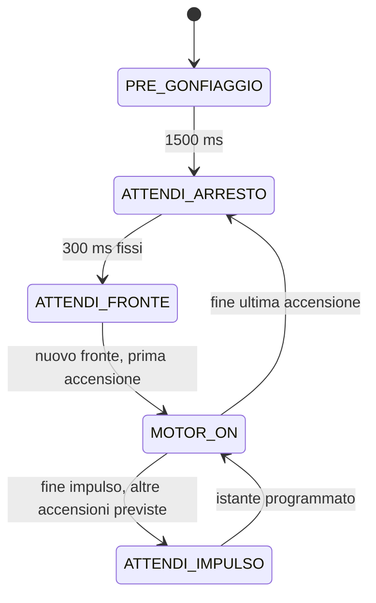

# Freno pneumatico — macchina a stati su Arduino Nano Every

Tutto il firmware e' in `sketchbook/FrenoPneumatico/FrenoPneumatico.ino`.
Ogni stato contiene una parte **ONCE**, eseguita all'ingresso, e una parte
**ALWAYS**, eseguita a ogni loop. La prima accensione di ogni sequenza dura
`IMPULSO_BLOCCAGGIO_MS`, inizialmente **150 ms**, per bloccare rapidamente il
freno. Le successive durano `IMPULSO_MANTENIMENTO_MS`, inizialmente **70 ms**,
per mantenere il blocco. La correzione modifica il tempo totale richiesto,
dal quale si sottrae il bloccaggio prima di calcolare il mantenimento.

## Sequenza



| Stato | ONCE: all'ingresso | ALWAYS: a ogni loop |
| --- | --- | --- |
| `PRE_GONFIAGGIO` | Ripristina la prova; accende la pompa | Dopo 1500 ms passa ad attesa arresto |
| `ATTENDI_ARRESTO` | Spegne la pompa; avvia il timeout | Dopo 300 ms passa soltanto a `ATTENDI_FRONTE`, indipendentemente dai fronti |
| `ATTENDI_FRONTE` | Mantiene la pompa spenta | Un nuovo fronte avvia una sequenza |
| `MOTOR_ON` | Alla prima accensione prepara e corregge la sequenza; a ogni ingresso accende e stampa il log | Dopo 150 ms per il bloccaggio o 70 ms per il mantenimento passa all'attesa successiva |
| `ATTENDI_IMPULSO` | Spegne la pompa | All'istante programmato avvia l'accensione successiva |
| `FERMO` | Spegne la pompa | Aspetta il comando di riavvio |

Una transizione esegue subito il ONCE del nuovo stato, nello stesso loop.
All'avvio il pregonfiaggio dura 1,5 secondi. Si passa poi a `ATTENDI_ARRESTO`
per un'attesa fissa di 300 ms. I fronti non riavviano il timeout e non
accendono la pompa: alla scadenza si entra soltanto in `ATTENDI_FRONTE`.
Anche un fronte osservato nel loop che chiude l'attesa viene consumato;
serve un nuovo fronte in `ATTENDI_FRONTE` per avviare la sequenza.

La prima sequenza emette il solo impulso di bloccaggio da 150 ms: manca
ancora un periodo `Dt` misurato. Il regolatore registra la base del confronto e
mantiene la richiesta iniziale di 200 ms. Anche il primo avvio dopo il
comando `a` segue questa regola.

## Distribuzione delle accensioni

Dal secondo avvio si usa il periodo misurato tra gli inizi di due sequenze.
Il bloccaggio e' sempre presente e viene sottratto dalla richiesta totale.
Si aggiunge mantenimento solo se la richiesta e' **strettamente maggiore**
del bloccaggio piu' un impulso di mantenimento:

```text
Dt = inizio sequenza attuale - inizio sequenza precedente
N = 1  [solo bloccaggio]
se Dt > 0 e richiesta > IMPULSO_BLOCCAGGIO_MS + IMPULSO_MANTENIMENTO_MS:
    residuo = richiesta - IMPULSO_BLOCCAGGIO_MS
    N += residuo / IMPULSO_MANTENIMENTO_MS       [divisione intera]
avvio dell'accensione k = inizio sequenza + floor(k * Dt / N)
k = 0, 1, ..., N-1
```

Con i parametri iniziali, la soglia e' **220 ms**: a 220 ms si genera il solo
bloccaggio; a 221 ms si aggiunge un mantenimento da 70 ms.
Con `Dt = 2000 ms` e richiesta di 300 ms, il residuo e' 150 ms: si generano
**3 accensioni**, agli istanti relativi **0, 666 e 1333 ms**, rispettivamente
**150, 70 e 70 ms**. Il tempo totale acceso e' **290 ms**: la divisione
arrotonda per difetto e il resto non viene recuperato.

Il bloccaggio da 150 ms viene comunque emesso anche se la richiesta e'
inferiore alla sua durata. Il regolatore conserva i limiti della richiesta
di 50 e 400 ms; la durata fisica minima della sequenza e' il bloccaggio.

Gli istanti vengono calcolati rispetto all'inizio della sequenza. Quando
`Dt` non e' divisibile per `N`, le distanze differiscono al massimo di 1 ms:
con `Dt = 2000 ms` e `N = 3`, gli avvii sono a 0, 666 e 1333 ms.
Il prodotto `k * Dt` usa 64 bit per evitare overflow.

I fronti durante `MOTOR_ON` e `ATTENDI_IMPULSO` vengono contati per la
correzione successiva; non interrompono, riavviano o accodano sequenze.
Dopo l'ultima accensione la pompa si spegne, attende 300 ms fissi e poi
aspetta un nuovo fronte. I fronti dell'attesa restano nel conteggio.
`ATTENDI_ARRESTO` e' un'attesa temporizzata e non verifica che l'encoder sia fermo.

Il numero di accensioni viene eventualmente ridotto perche' ogni distanza
fra avvii contenga l'impulso piu' lungo (150 ms con questi parametri) e
almeno 1 ms spento. Ogni accensione parte quando il loop osserva la scadenza
e misura la sua durata, di bloccaggio o mantenimento, dall'accensione effettiva.
Se il loop e' in ritardo, le accensioni possono
slittare e gli spegnimenti ritardare; non vengono eseguite transizioni
spento/acceso nello stesso millisecondo per recuperare le scadenze arretrate.

## Correzione del tempo richiesto

Tempo e contatore vengono campionati una volta, alla prima accensione della
sequenza. Le accensioni intermedie non cambiano questi campioni. Dal secondo
avvio si calcolano sullo stesso intervallo:

```text
T = Dt
n = contatore attuale - contatore all'inizio della sequenza precedente
obiettivo = n * 600 ms

T > obiettivo  -> tempo richiesto diminuisce di 20 ms
T < obiettivo  -> tempo richiesto aumenta di 20 ms
T = obiettivo  -> tempo richiesto invariato
```

La richiesta resta tra **50 e 400 ms**, con valore iniziale **200 ms**.
Una riduzione da 60 a 50 ms vale -10 ms per rispettare il limite minimo.
La nuova richiesta viene subito convertita nel numero di accensioni della
sequenza. Una correzione di 20 ms puo' lasciare invariato il numero di
mantenimenti, perche' il residuo viene diviso in accensioni intere da 70 ms.

`n` include tutti i fronti accettati dopo il campione della sequenza
precedente, durante accensioni e attese, compreso quello che avvia la nuova
sequenza. Il fronte che aveva avviato la precedente e' gia' nel campione
iniziale e non viene contato nuovamente. I fronti del pregonfiaggio non
influenzano la correzione. Contatore e `millis()` usano sottrazioni unsigned
per gestire il loro rollover; l'obiettivo `n * 600` usa 64 bit.

## Parametri e struttura locale

I parametri sono all'inizio del `.ino`:

| Parametro | Valore iniziale | Significato |
| --- | --- | --- |
| `DEBUG_PIN` | 12 / PE1 | Copia del livello grezzo dell'encoder |
| `ENCODER_HOLDOFF_US` | 2000 | Tempo minimo fra fronti accettati |
| `PRE_GONFIAGGIO_MS` | 1500 | Accensione iniziale |
| `TIMEOUT_ARRESTO_MS` | 300 | Attesa fissa dopo l'ultima accensione |
| `MS_PER_FRONTE` | 600 | Tempo obiettivo per ciascun fronte |
| `IMPULSO_BLOCCAGGIO_MS` | 150 | Prima accensione di ogni sequenza |
| `IMPULSO_MANTENIMENTO_MS` | 70 | Accensioni successive distribuite su Dt |
| `RICHIESTA_INIZIALE_MS` | 200 | Tempo totale richiesto iniziale |
| `PASSO_MS` | 20 | Correzione della richiesta per sequenza |
| `RICHIESTA_MINIMA_MS` | 50 | Richiesta minima |
| `RICHIESTA_MASSIMA_MS` | 400 | Richiesta massima |

```text
GIN/
├── README.md
├── sketchbook/
│   └── FrenoPneumatico/
│       └── FrenoPneumatico.ino
└── tests/
    ├── controller_test.cpp
    └── mock/
        ├── Arduino.h
        └── util/
            └── atomic.h
```

Usare `GIN` come repository locale. Nelle preferenze dell'IDE Arduino,
impostare **Posizione sketchbook** su `GIN/sketchbook`, oppure aprire il `.ino`
direttamente. La cartella dello sketch e il file principale hanno lo stesso
nome, come richiesto da Arduino. Installare **Arduino megaAVR Boards**,
scegliere **Arduino Nano Every** e **Registers emulation: None (ATMEGA4809)**.

## Collegamenti e seriale

| Segnale | Pin | Configurazione |
| --- | --- | --- |
| Preimpostazione | D11 | HIGH |
| Preimpostazione | D6 | HIGH |
| Preimpostazione | D4 | LOW |
| Comando pompa | D3 | HIGH acceso, LOW spento |
| Encoder | D14 / A0 | INPUT, senza pull-up interno, interrupt CHANGE |
| Debug encoder | D12 / PE1 | OUTPUT, copia del livello encoder a ogni interrupt |
| Ingresso aggiuntivo | PD6 | INPUT, buffer digitale attivo, senza pull-up o interrupt |
| Ingresso aggiuntivo | PA6 | INPUT, buffer digitale attivo, senza pull-up o interrupt |

In `setup()` ogni pin Arduino viene configurato con `pinMode()` prima di
`digitalWrite()`. Nel core megaAVR, `digitalWrite(HIGH)` su un ingresso
abilita il pull-up e non imposta il livello dell'uscita: per avviare D11 e
D6 HIGH bisogna prima configurarli come OUTPUT.

PD6 e PA6 vengono configurati direttamente in `setup()` tramite i registri
`PORTD` e `PORTA`, anche se non hanno un numero nella variante Arduino Nano
Every. `DIRCLR = PIN6_bm` imposta il solo bit 6 come ingresso;
`PIN6CTRL = 0` attiva il buffer digitale e disabilita pull-up e interrupt
del pin. La configurazione vale sia per ATmega3209 sia per ATmega4809.

L'ISR copia subito il livello letto su A0 nell'uscita PE1, prima del filtro:
il debug mostra anche i rimbalzi. Il primo fronte viene accettato; dopo
ciascun fronte accettato, quelli a meno di 2 ms vengono scartati dal contatore.
A 2 ms esatti un fronte e' nuovamente valido. I rimbalzi scartati non
prolungano il holdoff. Il filtro usa `micros()` e gestisce il suo rollover.

Si contano salita e discesa: un impulso completo alto/basso vale due fronti
se entrambi passano il filtro. Anche fronti reali distanziati meno di 2 ms
vengono scartati dal conteggio.
L'encoder deve fornire livelli definiti e compatibili, con massa comune alla
scheda. D3 comanda lo stadio di potenza del motore.

All'alimentazione o reset parte automaticamente il pregonfiaggio.
Monitor seriale a **115200 baud**, con o senza terminazione di riga:

| Comando | Effetto |
| --- | --- |
| `s` | Passa a `FERMO` e spegne la pompa nello stesso loop |
| `a` | Da `FERMO`, riparte con pregonfiaggio e richiesta iniziale di 200 ms |

`a` durante una prova attiva viene ignorato. Una nuova prova cancella i
campioni della precedente. I timer degli stati usano `millis()` e il filtro
encoder usa `micros()`, senza `delay()`.

Il log stampa `Avvio freno` all'alimentazione o reset, poi una riga a ogni
accensione fisica di controllo. Esempio di una sequenza: richiesta di 300 ms
distribuita su un periodo di 2000 ms, con correzione -20 ms all'inizio:

```text
Imp:150 Corr:-20 Dt:      2000 Fr:         1 Req:300 N:  1/  3
Imp: 70 Corr: +0 Dt:      2000 Fr:         1 Req:300 N:  2/  3
Imp: 70 Corr: +0 Dt:      2000 Fr:         1 Req:300 N:  3/  3
```

I primi campi restano nell'ordine impulso, correzione, tempo dal precedente
avvio di sequenza, fronti. `Imp`, `Corr`, `Dt` e `Req` sono in millisecondi.
`Imp` e' la durata dell'accensione attuale: 150 ms per il bloccaggio,
70 ms per il mantenimento. `Req` e' il tempo totale richiesto dal regolatore;
`N` indica l'accensione attuale e il numero totale.
Le colonne hanno larghezze fisse; ogni riga occupa 63 byte, incluso il newline.

`Corr` mostra la variazione effettiva della richiesta, applicata solo alla
prima accensione della sequenza; sulle successive vale 0. `Dt` e `Fr`
descrivono l'ultimo intervallo completato fra gli inizi di due sequenze e
restano uguali nelle righe di quella sequenza. Il conteggio in corso continua
nell'ISR e sara' campionato all'inizio della sequenza successiva.

La prima sequenza stampa `Imp:150`, `Dt:0`, `Fr:0`, `Corr:+0`, `Req:200` e
`N:1/1`, con spazi per allineare i campi. Anche dopo `a` riparte cosi', senza ripetere
la stringa di avvio. Il pregonfiaggio da 1500 ms non genera righe impulso.
Non ci sono messaggi periodici o di cambio stato.

Ogni riga viene inviata solo se entra interamente nel buffer UART; con
spazio insufficiente viene saltata, senza accodarla o aspettare.
Le stampe avvengono nel codice principale, fuori dall'ISR dell'encoder.

## Lettura atomica e verifiche

L'interrupt aggiorna PE1 e incrementa `encoderTotale` solo per fronti
accettati dal holdoff. La lettura del contatore usa
`ATOMIC_BLOCK(ATOMIC_RESTORESTATE)` della toolchain AVR: protegge la copia
a 32 bit sul microcontrollore a 8 bit e ripristina lo stato degli interrupt.
`tests/mock/util/atomic.h` e `tests/mock/Arduino.h` servono solo ai test PC,
non vanno copiati nello sketch e non verificano la concorrenza reale degli ISR.

Dalla radice del repository, con il core installato:

```sh
arduino-cli compile --fqbn arduino:megaavr:nona4809:mode=off sketchbook/FrenoPneumatico
```

Nel cloud:

```sh
/workspace/.tools/arduino/compile-nano-every.sh
```

La compilazione cloud usa Arduino CLI 1.4.1, megaAVR 1.8.8, API 1.3.1 e
AVR GCC Debian 14.2.0, diverso da quello del pacchetto Arduino standard.
Gli indici remoti e i tool di discovery non disponibili non impediscono
la compilazione con il core locale. Il caricamento USB non e' verificato.

I test verificano 22 gruppi: GPIO e prima sequenza, debug/holdoff,
rollover di `micros()`, ONCE, pregonfiaggio da 1500 ms e attesa iniziale fissa,
bloccaggio da 150 ms e due mantenimenti da 70 ms con richiesta di 300 ms su
2000 ms, conteggio dei fronti senza riavvio della sequenza, correzione,
distribuzione con intervalli frazionari, timestamp effettivo di avvio,
loop in ritardo, limiti della richiesta, stop/riavvio durante accensione
e pausa, rollover di `millis()` e del contatore, periodi lunghi con prodotti
a 64 bit, seriale congestionata, log di ogni accensione e spazio UART,
soglia stretta di mantenimento a 220 ms, distanza sufficiente per il
bloccaggio con periodi brevi.

```sh
set -e
mkdir -p /tmp/gin-tests
g++ -std=c++11 -Wall -Wextra -Werror -pedantic \
  -fsanitize=address,undefined -I tests/mock tests/controller_test.cpp \
  -o /tmp/gin-tests/controller_test
/tmp/gin-tests/controller_test
```

Se LeakSanitizer non puo' funzionare sotto `ptrace`, usare
`ASAN_OPTIONS=detect_leaks=0`: rimangono attivi AddressSanitizer e
UndefinedBehaviorSanitizer. I test simulati verificano il firmware; la
risposta pneumatica e il tempo reale di arresto vanno osservati sul prototipo.
