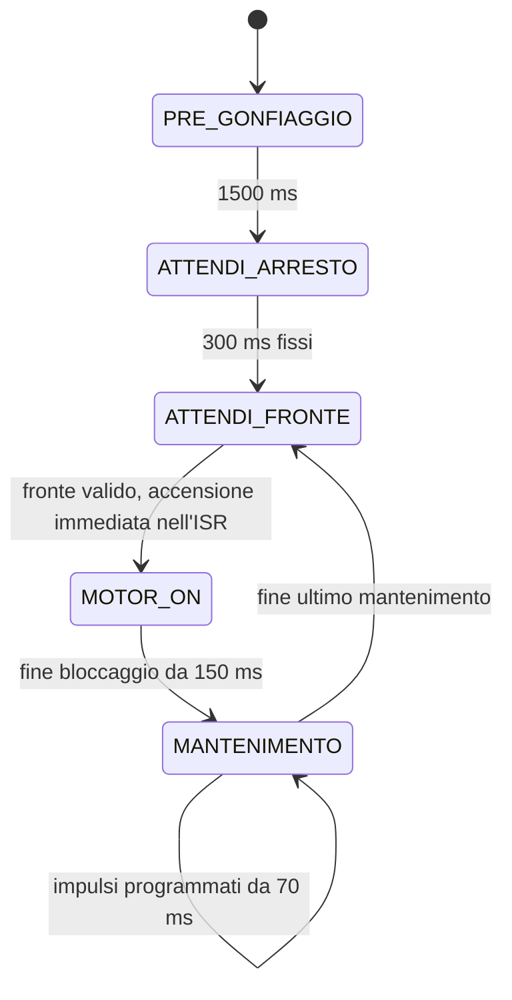

# Freno pneumatico — macchina a stati su Arduino Nano Every

Tutto il firmware e' in `sketchbook/FrenoPneumatico/FrenoPneumatico.ino`.
Ogni stato contiene una parte **ONCE**, eseguita all'ingresso, e una parte
**ALWAYS**, eseguita a ogni loop. La prima accensione di ogni sequenza dura
`IMPULSO_BLOCCAGGIO_MS`, inizialmente **150 ms**, per bloccare rapidamente il
freno. Le successive durano `IMPULSO_MANTENIMENTO_MS`, inizialmente **70 ms**,
per mantenere il blocco. La correzione modifica il tempo totale richiesto,
dal quale si sottrae il bloccaggio prima di calcolare il mantenimento.
Ogni sequenza programma almeno **150 + 70 = 220 ms** di accensione,
compresa la prima: un bloccaggio e almeno un mantenimento.
Si completa tutta la sequenza prima di abilitare un nuovo bloccaggio.
Durante la sequenza i fronti encoder vengono contati, senza riavviarla.
Gli avvii sono distanziati di almeno **500 ms**, parametro regolabile.

## Sequenza



| Stato | ONCE: all'ingresso | ALWAYS: a ogni loop |
| --- | --- | --- |
| `PRE_GONFIAGGIO` | Ripristina la prova; accende la pompa | Dopo 1500 ms passa ad attesa arresto |
| `ATTENDI_ARRESTO` | Spegne la pompa; avvia il timeout iniziale | Dopo 300 ms passa soltanto a `ATTENDI_FRONTE`, indipendentemente dai fronti |
| `ATTENDI_FRONTE` | Spegne la pompa e abilita l'accensione dall'ISR | Al primo fronte valido l'ISR accende; il loop passa a `MOTOR_ON` |
| `MOTOR_ON` | Prepara e corregge la nuova sequenza; stampa il log completo | Dopo 150 ms dal fronte passa a `MANTENIMENTO`; i fronti ulteriori vengono solo contati |
| `MANTENIMENTO` | Spegne la pompa e prepara i mantenimenti | Genera tutti i mantenimenti da 70 ms; conta i fronti senza riavviare il bloccaggio; alla fine torna a `ATTENDI_FRONTE` |
| `FERMO` | Spegne la pompa | Aspetta il comando di riavvio |

Una transizione esegue subito il ONCE del nuovo stato, nello stesso loop.
All'avvio il pregonfiaggio dura 1,5 secondi. Si passa poi a `ATTENDI_ARRESTO`
per un'attesa fissa di 300 ms. I fronti non riavviano il timeout e non
accendono la pompa: alla scadenza si entra soltanto in `ATTENDI_FRONTE`.
Anche un fronte osservato nel loop che chiude l'attesa viene consumato;
serve un nuovo fronte dopo l'abilitazione in `ATTENDI_FRONTE` per avviare la sequenza.
Questa attesa di 300 ms si esegue soltanto dopo il pregonfiaggio.

Il primo fronte valido in `ATTENDI_FRONTE` accende il motore
direttamente nell'ISR, prima dei calcoli e delle stampe. L'ISR registra
istante e contatore di quel fronte; il loop ricalcola una sola volta la
richiesta e passa a `MOTOR_ON`. Il bloccaggio dura 150 ms dal fronte rilevato.
L'accensione dall'ISR rimane disabilitata per tutto il bloccaggio e i
mantenimenti. Al termine si entra in `ATTENDI_FRONTE`: serve un nuovo
fronte valido dopo l'abilitazione, senza recuperare quelli gia' contati.

La prima sequenza mantiene la richiesta iniziale di 220 ms e registra la
base del confronto, senza correzione. Manca ancora un periodo `Dt` misurato:
si usa la distanza minima di 500 ms per distribuire le due accensioni,
da 150 ms a `t=0` e da 70 ms a `t=500`. Anche il primo avvio dopo il comando `a`
segue questa regola.

## Distribuzione delle accensioni

La richiesta viene limitata fra 220 e 400 ms. Il minimo e' calcolato come
`IMPULSO_BLOCCAGGIO_MS + IMPULSO_MANTENIMENTO_MS`: il bloccaggio da 150 ms
viene sottratto e il residuo contiene sempre almeno un mantenimento da 70 ms.
Si distribuiscono gli avvii sul periodo misurato. Quando non c'e' ancora
un `Dt`, oppure e' troppo breve, il periodo viene allargato per rispettare
`DISTANZA_MINIMA_IMPULSI_MS`, inizialmente 500 ms fra gli avvii.
Anche riducendo questo parametro, si lascia sempre almeno 1 ms spento
dopo l'impulso piu' lungo:

```text
Dt = inizio sequenza attuale - inizio sequenza precedente
residuo = richiesta - IMPULSO_BLOCCAGGIO_MS
N = 1 + residuo / IMPULSO_MANTENIMENTO_MS        [divisione intera; N >= 2]
distanza minima = max(DISTANZA_MINIMA_IMPULSI_MS, max(bloccaggio, mantenimento) + 1 ms)
periodo minimo = N * distanza minima
periodo distribuzione = max(Dt, periodo minimo)
avvio dell'accensione k = inizio sequenza + floor(k * periodo distribuzione / N)
k = 0, 1, ..., N-1
```

Con i parametri iniziali, a **220 ms** si generano sempre un bloccaggio e un
mantenimento. Anche una richiesta di 200 ms viene portata a 220 ms.
Fra 220 e 289 ms si programmano due accensioni; a 290 ms diventano tre.
Con `Dt = 2000 ms` e richiesta di 300 ms, il residuo e' 150 ms: si generano
**3 accensioni**, agli istanti relativi **0, 666 e 1333 ms**, rispettivamente
**150, 70 e 70 ms**. Il tempo totale acceso e' **290 ms**: la divisione
arrotonda per difetto e il resto non viene recuperato.

Le durate fisiche restano fisse, 150 e 70 ms. Il resto inferiore a 70 ms
non genera un altro mantenimento. La durata minima programmata e' 220 ms;
il controllo non scende al solo bloccaggio quando applica una correzione negativa.
`MS_PER_FRONTE = 600 ms` resta l'obiettivo della correzione per ciascun
fronte; la distanza minima fra le accensioni e' un parametro distinto.

Gli istanti vengono calcolati rispetto all'inizio della sequenza. Quando
il periodo di distribuzione non e' divisibile per `N`, le distanze
differiscono al massimo di 1 ms:
con `Dt = 2000 ms` e `N = 3`, gli avvii sono a 0, 666 e 1333 ms.
Il prodotto `k * periodo distribuzione` usa 64 bit per evitare overflow.

I fronti durante i 150 ms di `MOTOR_ON` e durante tutto `MANTENIMENTO`
vengono contati per la correzione successiva. Non riavviano il bloccaggio,
non cambiano la richiesta e non allungano le accensioni da 70 ms.
Questo vale anche per i fronti nelle pause e sulle scadenze degli impulsi.
Dopo l'ultimo mantenimento la pompa si spegne e passa a `ATTENDI_FRONTE`,
senza timeout. Soltanto allora viene riabilitata l'accensione dall'ISR.
Un fronte gia' contato durante la sequenza non avvia un altro bloccaggio;
serve un nuovo fronte valido dopo la fine. Il comando di stop puo'
interrompere la sequenza in qualunque momento.
`ATTENDI_ARRESTO` e' soltanto l'attesa iniziale temporizzata e non verifica
che l'encoder sia fermo.

Con `Dt = 600 ms` e richiesta di 400 ms si conservano quattro accensioni:
il periodo di distribuzione diventa 2000 ms, con avvii a 0, 500, 1000 e 1500 ms.
Il numero di mantenimenti non viene ridotto a causa del periodo breve.
`Dt` nel log resta il periodo effettivamente misurato, 600 ms in questo caso;
`t` e `d` mostrano gli avvii effettivi della distribuzione allargata.
I 500 ms sono misurati fra gli avvii: dopo un bloccaggio da 150 ms
rimangono 350 ms spenti, dopo un mantenimento da 70 ms rimangono 430 ms.
Il bloccaggio parte nell'ISR e i suoi 150 ms decorrono
da quell'istante, anche se il loop gestisce la richiesta in ritardo.
Ogni mantenimento parte quando il loop osserva la scadenza e dura 70 ms
dall'accensione effettiva. Se il loop e' in ritardo, i mantenimenti possono
slittare e gli spegnimenti ritardare. Fra un avvio effettivo e il successivo
si conserva almeno `floor(periodo distribuzione / N)`: non si eseguono
impulsi ravvicinati per recuperare le scadenze arretrate.

## Correzione del tempo richiesto

Tempo e contatore vengono campionati nell'ISR una volta, al fronte che avvia
il bloccaggio. I fronti successivi e le accensioni di mantenimento non
cambiano questi campioni. Il loop applica la correzione una sola volta
all'ingresso di `MOTOR_ON`, dopo aver completato la sequenza precedente e
rilevato un nuovo fronte valido. Dal secondo avvio si calcolano sullo stesso intervallo:

```text
n = contatore attuale - contatore all'inizio della sequenza precedente
tempo medio per fronte = Dt / n
errore medio = 600 ms - tempo medio per fronte
Kp = KP_PER_MILLE / 1000 = 0,10

correzione = arrotonda(Kp * errore medio)
richiesta = limita(richiesta precedente + correzione, minimo, massimo)
```

La correzione e' proporzionale allo scostamento del tempo medio rispetto
ai 600 ms obiettivo: media inferiore (movimento rapido) aumenta la richiesta;
media superiore (movimento lento) la diminuisce. Si aggiorna la richiesta
precedente, senza un passo fisso. Con `KP_PER_MILLE = 100`, un errore di
100 ms produce 10 ms di correzione; un errore di 300 ms ne produce 30.
Per attenuare la regolazione si puo' ridurre `KP_PER_MILLE`, per esempio a
50 (Kp = 0,05). Il guadagno va verificato sul prototipo.

Il calcolo intero usa prodotti a 64 bit e conserva la frazione di `Dt/n`
fino all'arrotondamento finale al millisecondo piu' vicino, simmetrico nei
due versi. Correzioni inferiori a mezzo millisecondo arrotondano a zero;
con `n = 0` non viene applicata correzione.

Esempi dai campioni misurati, prima dei limiti della richiesta:

| Dt (ms) | Fronti | Media (ms/fronte) | Correzione (ms) |
| --- | --- | --- | --- |
| 3340 | 8 | 417,5 | +18 |
| 2867 | 14 | 204,8 | +40 |
| 3738 | 4 | 934,5 | -33 |
| 2865 | 47 | 61,0 | +54 |
| 5059 | 5 | 1011,8 | -41 |

La richiesta resta tra **220 e 400 ms**, con valore iniziale **220 ms**.
Anche il valore iniziale viene limitato: impostare 500 ms con massimo
400 ms avvia direttamente a 400 ms. Nel log `Corr` indica la variazione
effettiva dopo i limiti: a 400 ms un incremento richiesto mostra `Corr:+0`,
mentre una riduzione puo' ancora essere applicata.
La nuova richiesta viene subito convertita nel numero di accensioni della
sequenza. Una correzione puo' lasciare invariato il numero di
mantenimenti, perche' il residuo viene diviso in accensioni intere da 70 ms.

`n` include tutti i fronti accettati dopo il campione della sequenza
precedente, durante accensioni e attese, compreso quello che avvia la nuova
sequenza. Il fronte che aveva avviato la precedente e' gia' nel campione
iniziale e non viene contato nuovamente. I fronti del pregonfiaggio non
influenzano la correzione. Contatore e `millis()` usano sottrazioni unsigned
per gestire il loro rollover; il calcolo proporzionale usa 64 bit.

## Parametri e struttura locale

I parametri sono all'inizio del `.ino`:

| Parametro | Valore iniziale | Significato |
| --- | --- | --- |
| `DEBUG_PIN` | 12 / PE1 | Copia del livello grezzo dell'encoder |
| `ENCODER_HOLDOFF_US` | 2000 | Tempo minimo fra fronti accettati |
| `PRE_GONFIAGGIO_MS` | 1500 | Accensione iniziale |
| `TIMEOUT_ARRESTO_MS` | 300 | Attesa iniziale fissa dopo il pregonfiaggio |
| `MS_PER_FRONTE` | 600 | Tempo obiettivo per ciascun fronte |
| `IMPULSO_BLOCCAGGIO_MS` | 150 | Prima accensione di ogni sequenza |
| `IMPULSO_MANTENIMENTO_MS` | 70 | Accensioni successive distribuite su Dt |
| `DISTANZA_MINIMA_IMPULSI_MS` | 500 | Distanza minima fra gli avvii, compreso il bloccaggio |
| `RICHIESTA_INIZIALE_MS` | 220 | Tempo totale richiesto iniziale, pari al minimo |
| `KP_PER_MILLE` | 100 | Guadagno proporzionale: 100 corrisponde a Kp = 0,10 |
| `RICHIESTA_MINIMA_MS` | 220 | Bloccaggio + un mantenimento, calcolato dalle due durate |
| `RICHIESTA_MASSIMA_MS` | 400 | Richiesta massima |

```text
GIN/
├── README.md
├── sketchbook/
│   └── FrenoPneumatico/
│       └── FrenoPneumatico.ino
└── tests/
    ├── controller_test.cpp
    └── mock/
        ├── Arduino.h
        └── util/
            └── atomic.h
```

Usare `GIN` come repository locale. Nelle preferenze dell'IDE Arduino,
impostare **Posizione sketchbook** su `GIN/sketchbook`, oppure aprire il `.ino`
direttamente. La cartella dello sketch e il file principale hanno lo stesso
nome, come richiesto da Arduino. Installare **Arduino megaAVR Boards**,
scegliere **Arduino Nano Every** e **Registers emulation: None (ATMEGA4809)**.

## Collegamenti e seriale

| Segnale | Pin | Configurazione |
| --- | --- | --- |
| Preimpostazione | D11 | HIGH |
| Preimpostazione | D6 | HIGH |
| Preimpostazione | D4 | LOW |
| Comando pompa | D3 | HIGH acceso, LOW spento |
| Encoder | D14 / A0 | INPUT, senza pull-up interno, interrupt CHANGE |
| Debug encoder | D12 / PE1 | OUTPUT, copia del livello encoder a ogni interrupt |
| Ingresso aggiuntivo | PD6 | INPUT, buffer digitale attivo, senza pull-up o interrupt |
| Ingresso aggiuntivo | PA6 | INPUT, buffer digitale attivo, senza pull-up o interrupt |

In `setup()` ogni pin Arduino viene configurato con `pinMode()` prima di
`digitalWrite()`. Nel core megaAVR, `digitalWrite(HIGH)` su un ingresso
abilita il pull-up e non imposta il livello dell'uscita: per avviare D11 e
D6 HIGH bisogna prima configurarli come OUTPUT.

PD6 e PA6 vengono configurati direttamente in `setup()` tramite i registri
`PORTD` e `PORTA`, anche se non hanno un numero nella variante Arduino Nano
Every. `DIRCLR = PIN6_bm` imposta il solo bit 6 come ingresso;
`PIN6CTRL = 0` attiva il buffer digitale e disabilita pull-up e interrupt
del pin. La configurazione vale sia per ATmega3209 sia per ATmega4809.

L'ISR copia subito il livello letto su A0 nell'uscita PE1, prima del filtro:
il debug mostra anche i rimbalzi. Il primo fronte viene accettato; dopo
ciascun fronte accettato, quelli a meno di 2 ms vengono scartati dal contatore.
A 2 ms esatti un fronte e' nuovamente valido. I rimbalzi scartati non
prolungano il holdoff. Il filtro usa `micros()` e gestisce il suo rollover.
Se il bloccaggio e' abilitato, lo stesso ISR attiva D3 immediatamente dopo
il filtro e registra il campione. Gli altri fronti vengono contati, ma non
possono sovrascriverlo o attivare un secondo bloccaggio fino alla fine di
tutta la sequenza di mantenimento e al ritorno in `ATTENDI_FRONTE`.
Nessun calcolo di correzione o log seriale viene eseguito nell'ISR.

Si contano salita e discesa: un impulso completo alto/basso vale due fronti
se entrambi passano il filtro. Anche fronti reali distanziati meno di 2 ms
vengono scartati dal conteggio.
L'encoder deve fornire livelli definiti e compatibili, con massa comune alla
scheda. D3 comanda lo stadio di potenza del motore.

All'alimentazione o reset parte automaticamente il pregonfiaggio.
Monitor seriale a **115200 baud**, con o senza terminazione di riga:

| Comando | Effetto |
| --- | --- |
| `s` | Passa a `FERMO` e spegne la pompa nello stesso loop |
| `a` | Da `FERMO`, riparte con pregonfiaggio e richiesta iniziale di 220 ms |

`a` durante una prova attiva viene ignorato. Una nuova prova cancella i
campioni della precedente. I timer degli stati usano `millis()` e il filtro
encoder usa `micros()`, senza `delay()`.

Il log stampa `Avvio freno` all'alimentazione o reset, poi una riga a ogni
avvio di bloccaggio e a ogni accensione di mantenimento. Esempio: richiesta
precedente di 340 ms, `Dt = 2000 ms`, 2 fronti. La media e' 1000 ms;
la correzione di -40 ms porta la richiesta a 300 ms:

```text
Imp:150 Corr: -40 Dt:      2000 Fr:    2 Req:300 1/3 t:0
2/3 t:       666 d:       666
3/3 t:      1333 d:       667
```

I primi campi restano nell'ordine impulso, correzione, tempo dal precedente
avvio di sequenza, fronti. `Imp`, `Corr`, `Dt`, `Req`, `t` e `d` sono in millisecondi.
La riga completa viene stampata solo sul primo impulso, quello di bloccaggio.
`Imp` e' la sua durata di 150 ms; `Req` e' il tempo totale richiesto dal
regolatore; `1/3` indica l'accensione attuale e il numero totale, senza il
prefisso `N:`. `Imp`, `Corr`, `Dt`, `Fr` e `Req` hanno larghezze minime fisse.
La riga tipica occupa 57 byte e, con i parametri attuali, al massimo 62,
incluso il newline: entra nel buffer UART anche con contatori a 10 cifre.
Per ogni mantenimento si stampano il progressivo, `t` e `d`:

- `t` e' il tempo dall'avvio del bloccaggio della sequenza corrente, dove
  riparte da zero; usa il timestamp effettivo dell'accensione.
- `d` e' la distanza dall'accensione precedente, compreso il bloccaggio
  per il primo mantenimento. Misura le accensioni fisiche anche quando
  una loro riga non e' stata stampata.

La numerazione include il bloccaggio iniziale, gia' indicato come `1/3`.
I fronti durante il mantenimento non generano una nuova riga completa
e non azzerano `t`. Dopo l'ultimo mantenimento, un nuovo fronte valido
avvia la sequenza successiva con `1/...`, `t:0`, `Dt`, `Fr` e correzione.

`Corr` mostra la variazione effettiva della richiesta, calcolata e applicata
solo alla prima accensione della sequenza. `Dt` e `Fr`
descrivono l'ultimo intervallo completato fra gli inizi di due sequenze e
restano invariati durante il mantenimento, senza essere ristampati.
Il conteggio in corso continua
nell'ISR e sara' campionato all'inizio della sequenza successiva.

La prima sequenza stampa `Imp:150`, `Dt:0`, `Fr:0`, `Corr:+0`, `Req:220` e
`1/2 t:0`, poi `2/2 t:500 d:500`, con spazi per allineare i campi.
Anche dopo `a` riparte cosi', senza ripetere la stringa di avvio.
Il pregonfiaggio da 1500 ms non genera righe impulso.
Non ci sono messaggi periodici o di cambio stato.

Ogni riga viene inviata solo se entra interamente nel buffer UART; con
spazio insufficiente viene saltata, senza accodarla o aspettare.
Le stampe avvengono nel codice principale, fuori dall'ISR dell'encoder.

## Lettura atomica e verifiche

L'interrupt aggiorna PE1 e incrementa `encoderTotale` solo per fronti
accettati dal holdoff. Quando il bloccaggio e' abilitato, accende D3 e salva
la richiesta con istante e contatore. Il loop usa
`ATOMIC_BLOCK(ATOMIC_RESTORESTATE)` della toolchain AVR per copiare insieme
richiesta e campioni a 32 bit sul microcontrollore a 8 bit, ripristinando poi
lo stato degli interrupt. Anche l'abilitazione di un nuovo bloccaggio e'
atomica. Durante `MOTOR_ON` e `MANTENIMENTO`, `encoderPronto` rimane falso:
l'ISR puo' contare i fronti senza cambiare l'uscita motore.
Il comando `s` disabilita il bloccaggio e cancella l'eventuale richiesta
prima del ricalcolo nel loop; i fronti in `FERMO` non riaccendono il motore.
`tests/mock/util/atomic.h` e `tests/mock/Arduino.h` servono solo ai test PC,
non vanno copiati nello sketch e non verificano la concorrenza reale degli ISR.

Dalla radice del repository, con il core installato:

```sh
arduino-cli compile --fqbn arduino:megaavr:nona4809:mode=off sketchbook/FrenoPneumatico
```

Nel cloud:

```sh
/workspace/.tools/arduino/compile-nano-every.sh
```

La compilazione cloud usa Arduino CLI 1.4.1, megaAVR 1.8.8, API 1.3.1 e
AVR GCC Debian 14.2.0, diverso da quello del pacchetto Arduino standard.
Gli indici remoti e i tool di discovery non disponibili non impediscono
la compilazione con il core locale. Il caricamento USB non e' verificato.

I test verificano 33 gruppi: GPIO e prima sequenza, debug/holdoff,
rollover di `micros()`, ONCE, pregonfiaggio da 1500 ms e attesa iniziale fissa,
bloccaggio da 150 ms e due mantenimenti da 70 ms con richiesta di 300 ms su
2000 ms, fronti contati in pausa e durante l'accensione senza riavvio,
fronti sulle scadenze senza nuovo bloccaggio, attesa di un fronte nuovo
dopo la sequenza senza timeout operativo, riproduzione dei fronti del log
che riavviavano il bloccaggio a 151 ms,
correzione proporzionale sui campioni misurati, media per fronte e
arrotondamento simmetrico, limiti e contatori grandi,
distribuzione con intervalli frazionari, timestamp e conteggio congelati nell'ISR,
fronte arrivato dopo la lettura dell'orologio del loop,
loop in ritardo, limiti della richiesta, stop/riavvio durante accensione
e pausa, stop con richiesta ISR pendente, rollover di `millis()` e del contatore, periodi lunghi con prodotti
a 64 bit, seriale congestionata, log di ogni accensione e spazio UART,
timestamp e distanze effettive anche con righe saltate e loop in ritardo,
righe con contatori e timestamp a 10 cifre entro il buffer da 63 byte,
minimo di 220 ms con mantenimento presente, prima sequenza senza Dt anche
con richiesta maggiore, distribuzione allargata con periodi brevi senza
eliminare mantenimenti, distanza minima di 500 ms fra gli avvii e
distanze conservate dopo un loop in ritardo.

```sh
set -e
mkdir -p /tmp/gin-tests
g++ -std=c++11 -Wall -Wextra -Werror -pedantic \
  -fsanitize=address,undefined -I tests/mock tests/controller_test.cpp \
  -o /tmp/gin-tests/controller_test
/tmp/gin-tests/controller_test
```

Se LeakSanitizer non puo' funzionare sotto `ptrace`, usare
`ASAN_OPTIONS=detect_leaks=0`: rimangono attivi AddressSanitizer e
UndefinedBehaviorSanitizer. I test simulati verificano il firmware; la
risposta pneumatica e il tempo reale di arresto vanno osservati sul prototipo.
