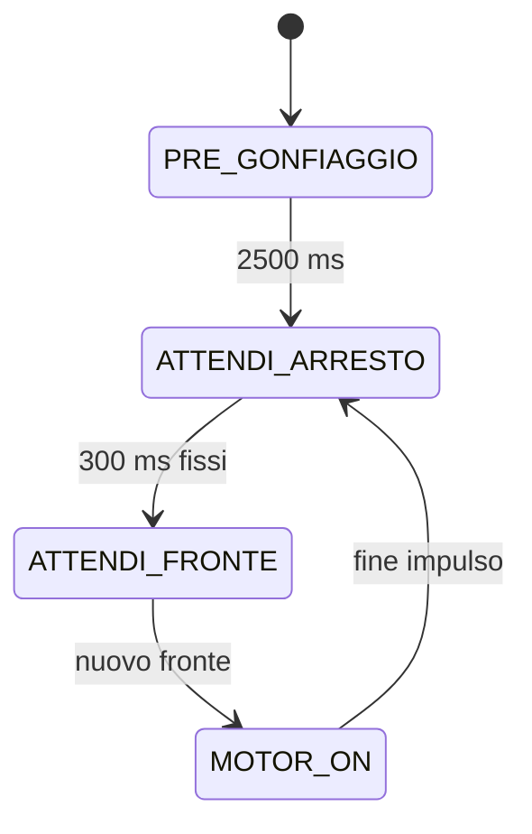

# Freno pneumatico — macchina a stati su Arduino Nano Every

Tutto il firmware e' in `sketchbook/FrenoPneumatico/FrenoPneumatico.ino`.
Ogni stato contiene una parte **ONCE**, eseguita all'ingresso, e una parte
**ALWAYS**, eseguita a ogni loop. Il timer del motore e la correzione della
sua durata vengono impostati solo nel ONCE di `MOTOR_ON`.

## Sequenza



| Stato | ONCE: all'ingresso | ALWAYS: a ogni loop |
| --- | --- | --- |
| `PRE_GONFIAGGIO` | Ripristina la prova; accende la pompa | Dopo 2500 ms passa ad attesa arresto |
| `ATTENDI_ARRESTO` | Spegne la pompa; avvia il timeout | Dopo 300 ms passa soltanto a `ATTENDI_FRONTE`, indipendentemente dai fronti |
| `ATTENDI_FRONTE` | Mantiene la pompa spenta | Un nuovo fronte avvia un impulso |
| `MOTOR_ON` | Corregge la durata; campiona tempo e contatore; accende la pompa | Conta i fronti senza prolungare il timer; alla scadenza torna ad attesa arresto |
| `FERMO` | Spegne la pompa | Aspetta il comando di riavvio |

Una transizione esegue subito il ONCE del nuovo stato, nello stesso loop.
All'avvio il pregonfiaggio dura 2,5 secondi. Si passa poi a `ATTENDI_ARRESTO`
per un'attesa fissa di 300 ms. I fronti non riavviano il timeout e non
accendono la pompa: alla scadenza si entra soltanto in `ATTENDI_FRONTE`.
Anche un fronte osservato nel loop che chiude l'attesa viene consumato;
serve un nuovo fronte in `ATTENDI_FRONTE` per avviare il motore.

Il primo impulso ha durata 200 ms. I fronti arrivati durante un motor-on
vengono contati, ma non riavviano il timer e non accodano impulsi. Alla
scadenza la pompa si spegne e parte una nuova attesa fissa di 300 ms,
misurata dallo spegnimento. I fronti accettati durante questa attesa
restano nel conteggio usato dalla correzione del prossimo impulso.

`ATTENDI_ARRESTO` e' quindi un'attesa temporizzata: il timeout non verifica
che l'encoder sia fermo.

## Correzione della durata motor-on

A ogni ingresso in `MOTOR_ON` si campionano il tempo corrente e il contatore
encoder cumulativo. Dal secondo ingresso si calcolano sullo stesso intervallo:

```text
T = tempo motor-on attuale - tempo motor-on precedente
n = contatore attuale - contatore al motor-on precedente
obiettivo = n * 600 ms

T > obiettivo  -> durata motor-on diminuisce di 20 ms
T < obiettivo  -> durata motor-on aumenta di 20 ms
T = obiettivo  -> durata motor-on invariata
```

La durata resta tra **50 e 400 ms**. Questi sono limiti temporali modificabili
nel sorgente. La correzione si esegue una volta all'ingresso di `MOTOR_ON`;
la nuova durata viene usata subito per quell'impulso. La saturazione al
minimo porta una riduzione da 60 ms a 50 ms, senza scendere a 40 ms.

`T` e' misurato tra gli avvii del motore, non tra i timestamp dei fronti.
Il campione `n` include tutti i fronti accettati dal filtro dopo il campione
del precedente motor-on, durante accensione e attesa, compreso il fronte che attiva il nuovo
motor-on. Il fronte che aveva attivato l'accensione precedente e' gia' nel
campione iniziale e non viene contato nuovamente. I fronti del pregonfiaggio
non influenzano la correzione: il primo motor-on registra soltanto la base.

Esempio: con 4 fronti tra due motor-on, il confronto e' con 2400 ms.
Un periodo di 2401 ms porta la durata da 200 a 180 ms; 2399 ms la porta a
220 ms; 2400 ms la lascia invariata. Contatore e `millis()` usano sottrazioni
unsigned, per gestire il loro rollover.

## Parametri e struttura locale

I parametri sono all'inizio del `.ino`:

| Parametro | Valore iniziale | Significato |
| --- | --- | --- |
| `DEBUG_PIN` | 12 / PE1 | Copia del livello grezzo dell'encoder |
| `ENCODER_HOLDOFF_US` | 2000 | Tempo minimo fra fronti accettati |
| `PRE_GONFIAGGIO_MS` | 2500 | Accensione iniziale |
| `TIMEOUT_ARRESTO_MS` | 300 | Attesa fissa dopo lo spegnimento |
| `MS_PER_FRONTE` | 600 | Tempo obiettivo per ciascun fronte |
| `IMPULSO_INIZIALE_MS` | 200 | Primo motor-on di controllo |
| `PASSO_MS` | 20 | Correzione della durata per intervallo |
| `IMPULSO_MINIMO_MS` | 50 | Durata minima |
| `IMPULSO_MASSIMO_MS` | 400 | Durata massima |

```text
GIN/
├── README.md
├── sketchbook/
│   └── FrenoPneumatico/
│       └── FrenoPneumatico.ino
└── tests/
    ├── controller_test.cpp
    └── mock/
        ├── Arduino.h
        └── util/
            └── atomic.h
```

Usare `GIN` come repository locale. Nelle preferenze dell'IDE Arduino,
impostare **Posizione sketchbook** su `GIN/sketchbook`, oppure aprire il `.ino`
direttamente. La cartella dello sketch e il file principale hanno lo stesso
nome, come richiesto da Arduino. Installare **Arduino megaAVR Boards**,
scegliere **Arduino Nano Every** e **Registers emulation: None (ATMEGA4809)**.

## Collegamenti e seriale

| Segnale | Pin | Configurazione |
| --- | --- | --- |
| Preimpostazione | D11 | HIGH |
| Preimpostazione | D6 | HIGH |
| Preimpostazione | D4 | LOW |
| Comando pompa | D3 | HIGH acceso, LOW spento |
| Encoder | D14 / A0 | INPUT, senza pull-up interno, interrupt CHANGE |
| Debug encoder | D12 / PE1 | OUTPUT, copia del livello encoder a ogni interrupt |
| Ingresso aggiuntivo | PD6 | INPUT, buffer digitale attivo, senza pull-up o interrupt |
| Ingresso aggiuntivo | PA6 | INPUT, buffer digitale attivo, senza pull-up o interrupt |

In `setup()` ogni pin Arduino viene configurato con `pinMode()` prima di
`digitalWrite()`. Nel core megaAVR, `digitalWrite(HIGH)` su un ingresso
abilita il pull-up e non imposta il livello dell'uscita: per avviare D11 e
D6 HIGH bisogna prima configurarli come OUTPUT.

PD6 e PA6 vengono configurati direttamente in `setup()` tramite i registri
`PORTD` e `PORTA`, anche se non hanno un numero nella variante Arduino Nano
Every. `DIRCLR = PIN6_bm` imposta il solo bit 6 come ingresso;
`PIN6CTRL = 0` attiva il buffer digitale e disabilita pull-up e interrupt
del pin. La configurazione vale sia per ATmega3209 sia per ATmega4809.

L'ISR copia subito il livello letto su A0 nell'uscita PE1, prima del filtro:
il debug mostra anche i rimbalzi. Il primo fronte viene accettato; dopo
ciascun fronte accettato, quelli a meno di 2 ms vengono scartati dal contatore.
A 2 ms esatti un fronte e' nuovamente valido. I rimbalzi scartati non
prolungano il holdoff. Il filtro usa `micros()` e gestisce il suo rollover.

Si contano salita e discesa: un impulso completo alto/basso vale due fronti
se entrambi passano il filtro. Anche fronti reali distanziati meno di 2 ms
vengono scartati dal conteggio.
L'encoder deve fornire livelli definiti e compatibili, con massa comune alla
scheda. D3 comanda lo stadio di potenza del motore.

All'alimentazione o reset parte automaticamente il pregonfiaggio.
Monitor seriale a **115200 baud**, con o senza terminazione di riga:

| Comando | Effetto |
| --- | --- |
| `s` | Passa a `FERMO` e spegne la pompa nello stesso loop |
| `a` | Da `FERMO`, riparte con pregonfiaggio e durata iniziale di 200 ms |

`a` durante una prova attiva viene ignorato. Una nuova prova cancella i
campioni della precedente. I timer degli stati usano `millis()` e il filtro
encoder usa `micros()`, senza `delay()`.

Il log stampa una stringa all'alimentazione o reset, poi una riga a ogni
avvio di un impulso di controllo (`MOTOR_ON`). Esempio:

```text
Avvio freno
Imp:200 Corr: +0 Dt:         0 Fr:         0
Imp:180 Corr:-20 Dt:       601 Fr:         1
Imp:200 Corr:+20 Dt:      1000 Fr:         3
```

I campi sono nell'ordine impulso, correzione, tempo dal precedente impulso,
fronti. `Imp`, `Corr` e `Dt` sono in millisecondi; `Fr` e' il numero di fronti.
Le larghezze fisse sono 3, 3, 10 e 10 caratteri, con allineamento a destra
e segno nella correzione. Ogni riga occupa 45 byte, incluso il newline.

`Imp` e' la durata applicata all'impulso appena avviato; `Dt` e' il tempo
tra gli avvii del motore, lo stesso usato dalla correzione. I fronti sono
quelli accettati tra il precedente motor-on e quello attuale, incluso il
fronte che avvia il nuovo impulso. La correzione indica la variazione
effettiva della durata: da 60 a 50 ms vale `-10 ms`; ai limiti minimo o
massimo vale `+0 ms` se la durata resta invariata.

Il primo impulso registra solo la base del confronto: tempo, fronti e
correzione valgono 0. Anche il primo impulso dopo il comando `a` riparte cosi', senza
ripetere la stringa di avvio. Il pregonfiaggio da 2500 ms non genera una
riga impulso. Non ci sono messaggi periodici o di cambio stato.

Ogni riga impulso viene inviata solo se entra interamente nel buffer UART;
con spazio insufficiente viene saltata, senza accodarla o aspettare.
Le stampe avvengono nel codice principale, fuori dall'ISR dell'encoder.

## Lettura atomica e verifiche

L'interrupt aggiorna PE1 e incrementa `encoderTotale` solo per fronti
accettati dal holdoff. La lettura del contatore usa
`ATOMIC_BLOCK(ATOMIC_RESTORESTATE)` della toolchain AVR: protegge la copia
a 32 bit sul microcontrollore a 8 bit e ripristina lo stato degli interrupt.
`tests/mock/util/atomic.h` e `tests/mock/Arduino.h` servono solo ai test PC,
non vanno copiati nello sketch e non verificano la concorrenza reale degli ISR.

Dalla radice del repository, con il core installato:

```sh
arduino-cli compile --fqbn arduino:megaavr:nona4809:mode=off sketchbook/FrenoPneumatico
```

Nel cloud:

```sh
/workspace/.tools/arduino/compile-nano-every.sh
```

La compilazione cloud usa Arduino CLI 1.4.1, megaAVR 1.8.8, API 1.3.1 e
AVR GCC Debian 14.2.0, diverso da quello del pacchetto Arduino standard.
Gli indici remoti e i tool di discovery non disponibili non impediscono
la compilazione con il core locale. Il caricamento USB non e' verificato.

I test verificano 17 gruppi: avvio/pin, copia debug e holdoff (inclusa la
soglia esatta di 2 ms), rollover di `micros()`, ONCE, attesa fissa dopo il
pregonfiaggio e dopo ogni impulso, correzione e conteggio, timestamp motor-on,
moto continuo, minimo di 50 ms, massimo di 400 ms, stop/riavvio, rollover
di `millis()` e del contatore, seriale congestionata, log di avvio e degli
impulsi con correzione effettiva, spazio UART sufficiente per l'intera riga.

```sh
set -e
mkdir -p /tmp/gin-tests
g++ -std=c++11 -Wall -Wextra -Werror -pedantic \
  -fsanitize=address,undefined -I tests/mock tests/controller_test.cpp \
  -o /tmp/gin-tests/controller_test
/tmp/gin-tests/controller_test
```

Se LeakSanitizer non puo' funzionare sotto `ptrace`, usare
`ASAN_OPTIONS=detect_leaks=0`: rimangono attivi AddressSanitizer e
UndefinedBehaviorSanitizer. I test simulati verificano il firmware; la
risposta pneumatica e il tempo reale di arresto vanno osservati sul prototipo.
