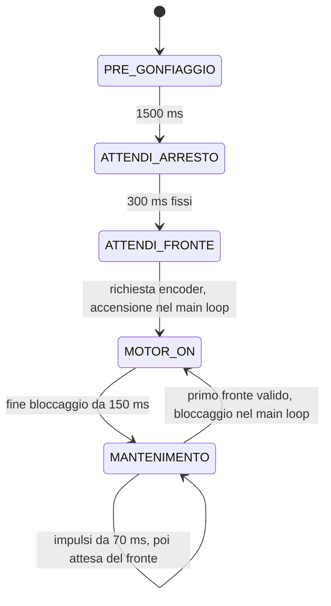

# Freno pneumatico — macchina a stati su Arduino Nano Every

Tutto il firmware e' in `sketchbook/FrenoPneumatico/FrenoPneumatico.ino`.
Ogni stato contiene una parte **ONCE**, eseguita all'ingresso, e una parte
**ALWAYS**, eseguita a ogni loop. La prima accensione di ogni sequenza dura
`IMPULSO_BLOCCAGGIO_MS`, inizialmente **150 ms**, per bloccare rapidamente il
freno. Le successive durano `IMPULSO_MANTENIMENTO_MS`, inizialmente **70 ms**,
per mantenere il blocco. La correzione modifica il tempo totale richiesto,
dal quale si sottrae il bloccaggio prima di calcolare il mantenimento.
Ogni sequenza programma almeno **150 + 70 = 220 ms** di accensione,
compresa la prima: un bloccaggio e almeno un mantenimento.
Durante il bloccaggio i fronti encoder vengono contati senza riavviarlo.
In `MANTENIMENTO` si attende gia' il prossimo fronte: appena arriva,
interrompe i mantenimenti residui e avvia subito un nuovo bloccaggio.
Gli intervalli derivano da `Dt`, senza una distanza minima impostata.

## Sequenza



| Stato | ONCE: all'ingresso | ALWAYS: a ogni loop |
| --- | --- | --- |
| `PRE_GONFIAGGIO` | Ripristina la prova; accende la pompa | Dopo 1500 ms passa ad attesa arresto |
| `ATTENDI_ARRESTO` | Spegne la pompa; avvia il timeout iniziale | Dopo 300 ms passa soltanto a `ATTENDI_FRONTE`, indipendentemente dai fronti |
| `ATTENDI_FRONTE` | Spegne la pompa e abilita la richiesta encoder | Attesa del primo avvio dopo il pregonfiaggio; al fronte passa a `MOTOR_ON` |
| `MOTOR_ON` | Accende la pompa, campiona tempo e fronti, corregge la nuova sequenza e stampa il log | Dopo 150 ms dall'accensione passa a `MANTENIMENTO`; i fronti ulteriori vengono solo contati |
| `MANTENIMENTO` | Spegne la pompa, prepara i mantenimenti e abilita il fronte | Genera le accensioni da 70 ms, poi rimane qui in attesa; al primo fronte interrompe la sequenza e torna a `MOTOR_ON` |
| `FERMO` | Spegne la pompa | Aspetta il comando di riavvio |

Una transizione esegue subito il ONCE del nuovo stato, nello stesso loop.
All'avvio il pregonfiaggio dura 1,5 secondi. Si passa poi a `ATTENDI_ARRESTO`
per un'attesa fissa di 300 ms. I fronti non riavviano il timeout e non
accendono la pompa: alla scadenza si entra soltanto in `ATTENDI_FRONTE`.
Anche un fronte osservato nel loop che chiude l'attesa viene consumato;
serve un nuovo fronte dopo l'abilitazione in `ATTENDI_FRONTE` per avviare la sequenza.
Questa attesa di 300 ms si esegue soltanto dopo il pregonfiaggio.

Il primo fronte valido in `ATTENDI_FRONTE` o `MANTENIMENTO` imposta la
richiesta di bloccaggio nell'ISR. L'ISR non comanda il motore. Il main loop
consuma la richiesta e passa a `MOTOR_ON`, cancellando i mantenimenti residui.
Nel ONCE accende il motore prima dei calcoli e delle stampe, poi campiona
tempo e contatore per la correzione. Il bloccaggio dura
`IMPULSO_BLOCCAGGIO_MS`, inizialmente 150 ms dall'accensione nel main loop:
la correzione non modifica questa durata. La richiesta di un altro
bloccaggio rimane disabilitata durante `MOTOR_ON`; si riabilita all'ingresso
di `MANTENIMENTO`. I fronti gia' contati durante il bloccaggio non vengono
accodati: serve un nuovo fronte dopo l'abilitazione.
Se il fronte arriva durante un mantenimento acceso, il motore rimane HIGH
senza una commutazione LOW; i nuovi 150 ms decorrono dall'ingresso in
`MOTOR_ON` nel main loop.

La prima sequenza mantiene la richiesta iniziale di 220 ms e registra la
base del confronto, senza correzione. Manca ancora un periodo `Dt` misurato:
si usa `MS_PER_FRONTE = 600 ms` per distribuire le due accensioni,
da 150 ms a `t=0` e da 70 ms a `t=300`. Anche il primo avvio dopo il comando `a`
segue questa regola.

## Distribuzione delle accensioni

La richiesta viene limitata fra 220 e 2000 ms. Il minimo e' calcolato come
`IMPULSO_BLOCCAGGIO_MS + IMPULSO_MANTENIMENTO_MS`: il bloccaggio da 150 ms
viene sottratto e il residuo contiene sempre almeno un mantenimento da 70 ms.
Si distribuiscono gli avvii sul periodo misurato; soltanto quando non
c'e' ancora un `Dt` si usa 600 ms. Il periodo non viene allargato e non
viene imposta una distanza minima fra gli avvii:

```text
Dt = inizio sequenza attuale - inizio sequenza precedente
residuo = richiesta - IMPULSO_BLOCCAGGIO_MS
N = 1 + residuo / IMPULSO_MANTENIMENTO_MS        [divisione intera; N >= 2]
periodo distribuzione = Dt se Dt > 0, altrimenti MS_PER_FRONTE
avvio dell'accensione k = inizio sequenza + floor(k * periodo distribuzione / N)
k = 0, 1, ..., N-1
```

Con i parametri iniziali, a **220 ms** si programmano un bloccaggio e un
mantenimento. Anche una richiesta di 200 ms viene portata a 220 ms.
Fra 220 e 289 ms si programmano due accensioni; a 290 ms diventano tre.
Con `Dt = 2000 ms` e richiesta di 300 ms, il residuo e' 150 ms: si programmano
**3 accensioni**, agli istanti relativi **0, 666 e 1333 ms**, rispettivamente
**150, 70 e 70 ms**. Il tempo totale acceso e' **290 ms**: la divisione
arrotonda per difetto e il resto non viene recuperato. Questi istanti e
totali valgono se non arrivano fronti che interrompono il mantenimento.
Alla richiesta massima di **2000 ms** si programmano un bloccaggio e
**26 mantenimenti**, per **27 accensioni** e 1970 ms totali accesi.

Le durate fisiche restano fisse, 150 e 70 ms. Il resto inferiore a 70 ms
non genera un altro mantenimento. La durata minima programmata e' 220 ms;
il controllo non scende al solo bloccaggio quando applica una correzione negativa.
`MS_PER_FRONTE = 600 ms` e' l'obiettivo della correzione per ciascun
fronte e il periodo usato soltanto per distribuire la prima sequenza.

Gli istanti vengono calcolati rispetto all'inizio della sequenza. Quando
il periodo di distribuzione non e' divisibile per `N`, le distanze
differiscono al massimo di 1 ms:
con `Dt = 2000 ms` e `N = 3`, gli avvii sono a 0, 666 e 1333 ms.
Il prodotto `k * periodo distribuzione` usa 64 bit per evitare overflow.

I fronti durante i 150 ms di `MOTOR_ON` vengono contati per la correzione
successiva, senza riavviare o allungare il bloccaggio. In `MANTENIMENTO`,
il primo fronte valido interrompe la sequenza, sia durante un'accensione
da 70 ms sia in una pausa. Ha precedenza anche sulle scadenze degli impulsi.
Dopo l'ultimo mantenimento la pompa si spegne e rimane in `MANTENIMENTO`
in attesa del fronte, senza timeout e senza passare a `ATTENDI_FRONTE`.
Questo ultimo stato serve soltanto al primo avvio dopo il pregonfiaggio.
Il comando di stop puo' interrompere la sequenza in qualunque momento.
`ATTENDI_ARRESTO` e' soltanto l'attesa iniziale temporizzata e non verifica
che l'encoder sia fermo.

Con `Dt = 500 ms` e richiesta di 400 ms si programmano quattro accensioni
con intervallo di 125 ms. Il bloccaggio iniziale dura comunque 150 ms:
il primo mantenimento aspetta lo spegnimento e parte nel loop successivo.
Con un loop ogni millisecondo gli avvii sono a 0, 151, 276 e 401 ms;
il periodo di distribuzione e `Dt` rimangono entrambi 500 ms.
Non si sovrappongono due accensioni. Se l'intervallo calcolato e' piu'
breve della durata di un impulso, si aspetta la sua fine e un loop
successivo con il motore spento prima di iniziare il mantenimento seguente.
`t` e `d` mostrano sempre gli avvii effettivi.
Il bloccaggio parte nel main loop e i suoi 150 ms decorrono da
quell'accensione effettiva. Un ritardo fra il fronte encoder e il main
loop ritarda l'accensione, senza accorciare i 150 ms.
Ogni mantenimento parte quando il loop osserva la scadenza e dura 70 ms
dall'accensione effettiva. Se il loop e' in ritardo, i mantenimenti possono
slittare e gli spegnimenti ritardare. Fra un avvio effettivo e il successivo
si conserva almeno `floor(periodo distribuzione / N)`: non si eseguono
impulsi ravvicinati per recuperare le scadenze arretrate.

## Correzione del tempo richiesto

Tempo e contatore vengono campionati insieme nel main loop una volta,
all'accensione di bloccaggio. I fronti successivi e le accensioni di mantenimento non
cambiano questi campioni. Il loop applica la correzione una sola volta
all'ingresso di `MOTOR_ON`, anche quando un fronte interrompe il mantenimento.
Dal secondo avvio si calcolano sullo stesso intervallo:

```text
n = contatore attuale - contatore all'inizio della sequenza precedente
tempo medio per fronte = Dt / n
errore medio = 600 ms - tempo medio per fronte
Kp = KP_PER_MILLE / 1000 = 1

correzione = arrotonda(Kp * errore medio)
richiesta = limita(richiesta precedente + correzione, minimo, massimo)
```

La correzione e' proporzionale allo scostamento del tempo medio rispetto
ai 600 ms obiettivo: media inferiore (movimento rapido) aumenta la richiesta;
media superiore (movimento lento) la diminuisce. Si aggiorna la richiesta
precedente, senza un passo fisso. Con `KP_PER_MILLE = 1000`, un errore di
100 ms produce 100 ms di correzione; un errore di 300 ms ne produce 300.
Per attenuare la regolazione si puo' ridurre `KP_PER_MILLE`, per esempio a
100 (Kp = 0,10). Il guadagno va verificato sul prototipo.

Il calcolo intero usa prodotti a 64 bit e conserva la frazione di `Dt/n`
fino all'arrotondamento finale al millisecondo piu' vicino, simmetrico nei
due versi. Correzioni inferiori a mezzo millisecondo arrotondano a zero;
con `n = 0` non viene applicata correzione.

Esempi dai campioni misurati, prima dei limiti della richiesta:

| Dt (ms) | Fronti | Media (ms/fronte) | Correzione (ms) |
| --- | --- | --- | --- |
| 3340 | 8 | 417,5 | +183 |
| 2867 | 14 | 204,8 | +395 |
| 3738 | 4 | 934,5 | -335 |
| 2865 | 47 | 61,0 | +539 |
| 5059 | 5 | 1011,8 | -412 |

La richiesta resta tra **220 e 2000 ms**, con valore iniziale **220 ms**.
Anche il valore iniziale viene limitato: impostare 2500 ms con massimo
2000 ms avvia direttamente a 2000 ms. Nel log `Corr` indica la variazione
effettiva dopo i limiti: a 2000 ms un incremento richiesto mostra `Corr:+0`,
mentre una riduzione puo' ancora essere applicata.
La nuova richiesta viene subito convertita nel numero di accensioni della
sequenza. Una correzione puo' lasciare invariato il numero di
mantenimenti, perche' il residuo viene diviso in accensioni intere da 70 ms.

`n` include tutti i fronti accettati dopo il campione della sequenza
precedente, durante accensioni e attese, compreso quello che avvia la nuova
sequenza. Il fronte che aveva avviato la precedente e' gia' nel campione
iniziale e non viene contato nuovamente. I fronti del pregonfiaggio non
influenzano la correzione. Contatore e `millis()` usano sottrazioni unsigned
per gestire il loro rollover; il calcolo proporzionale usa 64 bit.

## Parametri e struttura locale

I parametri sono all'inizio del `.ino`:

| Parametro | Valore iniziale | Significato |
| --- | --- | --- |
| `DEBUG_PIN` | 12 / PE1 | Copia del livello grezzo dell'encoder |
| `ENCODER_HOLDOFF_US` | 2000 | Tempo minimo fra fronti accettati |
| `PRE_GONFIAGGIO_MS` | 1500 | Accensione iniziale |
| `TIMEOUT_ARRESTO_MS` | 300 | Attesa iniziale fissa dopo il pregonfiaggio |
| `MS_PER_FRONTE` | 600 | Tempo obiettivo per ciascun fronte |
| `IMPULSO_BLOCCAGGIO_MS` | 150 | Prima accensione di ogni sequenza |
| `IMPULSO_MANTENIMENTO_MS` | 70 | Accensioni successive distribuite su Dt |
| `RICHIESTA_INIZIALE_MS` | 220 | Tempo totale richiesto iniziale, pari al minimo |
| `KP_PER_MILLE` | 1000 | Guadagno proporzionale: 1000 corrisponde a Kp = 1 |
| `RICHIESTA_MINIMA_MS` | 220 | Bloccaggio + un mantenimento, calcolato dalle due durate |
| `RICHIESTA_MASSIMA_MS` | 2000 | Richiesta massima |

```text
GIN/
├── README.md
├── sketchbook/
│   └── FrenoPneumatico/
│       └── FrenoPneumatico.ino
└── tests/
    ├── controller_test.cpp
    └── mock/
        ├── Arduino.h
        └── util/
            └── atomic.h
```

Usare `GIN` come repository locale. Nelle preferenze dell'IDE Arduino,
impostare **Posizione sketchbook** su `GIN/sketchbook`, oppure aprire il `.ino`
direttamente. La cartella dello sketch e il file principale hanno lo stesso
nome, come richiesto da Arduino. Installare **Arduino megaAVR Boards**,
scegliere **Arduino Nano Every** e **Registers emulation: None (ATMEGA4809)**.

## Collegamenti e seriale

| Segnale | Pin | Configurazione |
| --- | --- | --- |
| Preimpostazione | D11 | HIGH |
| Preimpostazione | D6 | HIGH |
| Preimpostazione | D4 | LOW |
| Comando pompa | D3 | HIGH acceso, LOW spento |
| Encoder | D14 / A0 | INPUT, senza pull-up interno, interrupt CHANGE |
| Debug encoder | D12 / PE1 | OUTPUT, copia del livello encoder a ogni interrupt |
| Ingresso aggiuntivo | PD6 | INPUT, buffer digitale attivo, senza pull-up o interrupt |
| Ingresso aggiuntivo | PA6 | INPUT, buffer digitale attivo, senza pull-up o interrupt |

In `setup()` ogni pin Arduino viene configurato con `pinMode()` prima di
`digitalWrite()`. Nel core megaAVR, `digitalWrite(HIGH)` su un ingresso
abilita il pull-up e non imposta il livello dell'uscita: per avviare D11 e
D6 HIGH bisogna prima configurarli come OUTPUT.

PD6 e PA6 vengono configurati direttamente in `setup()` tramite i registri
`PORTD` e `PORTA`, anche se non hanno un numero nella variante Arduino Nano
Every. `DIRCLR = PIN6_bm` imposta il solo bit 6 come ingresso;
`PIN6CTRL = 0` attiva il buffer digitale e disabilita pull-up e interrupt
del pin. La configurazione vale sia per ATmega3209 sia per ATmega4809.

L'ISR copia subito il livello letto su A0 nell'uscita PE1, prima del filtro:
il debug mostra anche i rimbalzi. Il primo fronte viene accettato; dopo
ciascun fronte accettato, quelli a meno di 2 ms vengono scartati dal contatore.
A 2 ms esatti un fronte e' nuovamente valido. I rimbalzi scartati non
prolungano il holdoff. Il filtro usa `micros()` e gestisce il suo rollover.
Se il bloccaggio e' abilitato, l'ISR imposta `bloccaggioRichiesto` e
disabilita altre richieste fino alla fine dei 150 ms e all'ingresso in
`MANTENIMENTO`, che riabilita subito il fronte. Gli altri fronti vengono
comunque contati. Il main loop accende D3 e campiona istante e contatore,
includendo anche i fronti arrivati fra la richiesta e l'accensione.
Nell'ISR non si comanda D3, non si calcola la correzione e non si stampa.

Si contano salita e discesa: un impulso completo alto/basso vale due fronti
se entrambi passano il filtro. Anche fronti reali distanziati meno di 2 ms
vengono scartati dal conteggio.
L'encoder deve fornire livelli definiti e compatibili, con massa comune alla
scheda. D3 comanda lo stadio di potenza del motore.

All'alimentazione o reset parte automaticamente il pregonfiaggio.
Monitor seriale a **115200 baud**, con o senza terminazione di riga:

| Comando | Effetto |
| --- | --- |
| `s` | Passa a `FERMO` e spegne la pompa nello stesso loop |
| `a` | Da `FERMO`, riparte con pregonfiaggio e richiesta iniziale di 220 ms |

`a` durante una prova attiva viene ignorato. Una nuova prova cancella i
campioni della precedente. I timer degli stati usano `millis()` e il filtro
encoder usa `micros()`, senza `delay()`.

Il log stampa `Avvio freno` all'alimentazione o reset, poi una riga a ogni
avvio di bloccaggio e a ogni accensione di mantenimento. Esempio: richiesta
precedente di 700 ms, `Dt = 2000 ms`, 2 fronti. La media e' 1000 ms;
la correzione di -400 ms porta la richiesta a 300 ms:

```text
Imp:150 Corr:-400 Dt:      2000 Fr:    2 Req:300 1/3 t:0
2/3 t:       666 d:       666
3/3 t:      1333 d:       667
```

I primi campi restano nell'ordine impulso, correzione, tempo dal precedente
avvio di sequenza, fronti. `Imp`, `Corr`, `Dt`, `Req`, `t` e `d` sono in millisecondi.
La riga completa viene stampata solo sul primo impulso, quello di bloccaggio.
`Imp` e' la sua durata di 150 ms; `Req` e' il tempo totale richiesto dal
regolatore; `1/3` indica l'accensione attuale e il numero totale, senza il
prefisso `N:`. `Imp`, `Corr`, `Dt`, `Fr` e `Req` hanno larghezze minime fisse.
La riga tipica occupa 57 byte, incluso il newline. Richieste a quattro
cifre e numerazione fino a `27/27` possono allargarla; con contatori
molto grandi puo' superare i 63 byte disponibili nella UART. In questo
caso viene saltata, come ogni riga che non entra nel buffer, mantenendo
corretti i timer e le distanze fisiche degli impulsi.
Per ogni mantenimento si stampano il progressivo, `t` e `d`:

- `t` e' il tempo dall'avvio del bloccaggio della sequenza corrente, dove
  riparte da zero; usa il timestamp effettivo dell'accensione.
- `d` e' la distanza dall'accensione precedente, compreso il bloccaggio
  per il primo mantenimento. Misura le accensioni fisiche anche quando
  una loro riga non e' stata stampata.

La numerazione include il bloccaggio iniziale, gia' indicato come `1/3`.
Se un fronte interrompe il mantenimento, genera una nuova riga completa
con `1/...`, `t:0`, `Dt`, `Fr` e correzione. I mantenimenti residui della
vecchia sequenza vengono cancellati e i loro progressivi non sono stampati.

`Corr` mostra la variazione effettiva della richiesta, calcolata e applicata
solo alla prima accensione della sequenza. `Dt` e `Fr`
descrivono l'ultimo intervallo completato fra gli inizi di due sequenze e
restano invariati durante il mantenimento, senza essere ristampati.
Il conteggio in corso continua
nell'ISR e sara' campionato all'inizio della sequenza successiva.

La prima sequenza stampa `Imp:150`, `Dt:0`, `Fr:0`, `Corr:+0`, `Req:220` e
`1/2 t:0`, poi `2/2 t:300 d:300`, con spazi per allineare i campi.
Anche dopo `a` riparte cosi', senza ripetere la stringa di avvio.
Il pregonfiaggio da 1500 ms non genera righe impulso.
Non ci sono messaggi periodici o di cambio stato.

Ogni riga viene inviata solo se entra interamente nel buffer UART; con
spazio insufficiente viene saltata, senza accodarla o aspettare.
Le stampe avvengono nel codice principale, fuori dall'ISR dell'encoder.

## Lettura atomica e verifiche

L'interrupt aggiorna PE1 e incrementa `encoderTotale` solo per fronti
accettati dal holdoff. Quando il bloccaggio e' abilitato, imposta soltanto
la richiesta. Il loop usa `ATOMIC_BLOCK(ATOMIC_RESTORESTATE)` della
toolchain AVR per consumarla; nel ONCE di `MOTOR_ON` accende D3 e campiona
insieme tempo e contatore a 32 bit sul microcontrollore a 8 bit,
ripristinando poi lo stato degli interrupt. Anche l'abilitazione del
fronte e le commutazioni dei mantenimenti sono atomiche: una richiesta
gia' arrivata ha precedenza sulle scadenze e viene gestita nel prossimo loop.
Durante `MOTOR_ON`, `encoderPronto` rimane falso: l'ISR conta i fronti
senza cambiare l'uscita motore. In `MANTENIMENTO` rimane abilitato fino al
primo fronte valido, anche dopo la fine delle accensioni programmate.
Il comando `s` disabilita il bloccaggio e cancella l'eventuale richiesta
prima del ricalcolo nel loop; i fronti in `FERMO` non riaccendono il motore.
`tests/mock/util/atomic.h` e `tests/mock/Arduino.h` servono solo ai test PC,
non vanno copiati nello sketch e non verificano la concorrenza reale degli ISR.

Dalla radice del repository, con il core installato:

```sh
arduino-cli compile --fqbn arduino:megaavr:nona4809:mode=off sketchbook/FrenoPneumatico
```

Nel cloud:

```sh
/workspace/.tools/arduino/compile-nano-every.sh
```

La compilazione cloud usa Arduino CLI 1.4.1, megaAVR 1.8.8, API 1.3.1 e
AVR GCC Debian 14.2.0, diverso da quello del pacchetto Arduino standard.
Gli indici remoti e i tool di discovery non disponibili non impediscono
la compilazione con il core locale. Il caricamento USB non e' verificato.

I test verificano 34 gruppi: GPIO e prima sequenza, debug/holdoff,
rollover di `micros()`, ONCE, pregonfiaggio da 1500 ms e attesa iniziale fissa,
bloccaggio da 150 ms e due mantenimenti da 70 ms con richiesta di 300 ms su
2000 ms, interruzione del mantenimento in pausa e durante l'accensione,
precedenza del fronte sulle scadenze, attesa nello stesso stato dopo
l'ultimo mantenimento senza timeout operativo, fronti durante il bloccaggio
contati senza riavviarlo e nuovo fronte abilitato gia' a 151 ms,
correzione proporzionale sui campioni misurati, media per fronte e
arrotondamento simmetrico, limiti e contatori grandi,
distribuzione con intervalli frazionari, timestamp e conteggio campionati nel main loop,
fronte arrivato dopo la lettura dell'orologio del loop,
ISR senza scritture motore, avvio ritardato di 250 ms con bloccaggio
comunque da 150 ms, sequenze fino a 27 accensioni con richiesta di 2000 ms,
loop in ritardo, limiti della richiesta, stop/riavvio durante accensione
e pausa, stop con richiesta ISR pendente, rollover di `millis()` e del contatore, periodi lunghi con prodotti
a 64 bit, seriale congestionata, log di ogni accensione e spazio UART,
timestamp e distanze effettive anche con righe saltate e loop in ritardo,
righe con contatori e timestamp a 10 cifre, righe da 63 byte inviate e
righe piu' lunghe saltate senza ritardare il motore,
minimo di 220 ms con mantenimento presente, prima sequenza senza Dt anche
con richiesta maggiore, distribuzione sul Dt misurato senza distanza
minima impostata, accensioni senza sovrapposizione con periodi brevi e
intervalli conservati dopo un loop in ritardo.

```sh
set -e
mkdir -p /tmp/gin-tests
g++ -std=c++11 -Wall -Wextra -Werror -pedantic \
  -fsanitize=address,undefined -I tests/mock tests/controller_test.cpp \
  -o /tmp/gin-tests/controller_test
/tmp/gin-tests/controller_test
```

Se LeakSanitizer non puo' funzionare sotto `ptrace`, usare
`ASAN_OPTIONS=detect_leaks=0`: rimangono attivi AddressSanitizer e
UndefinedBehaviorSanitizer. I test simulati verificano il firmware; la
risposta pneumatica e il tempo reale di arresto vanno osservati sul prototipo.
