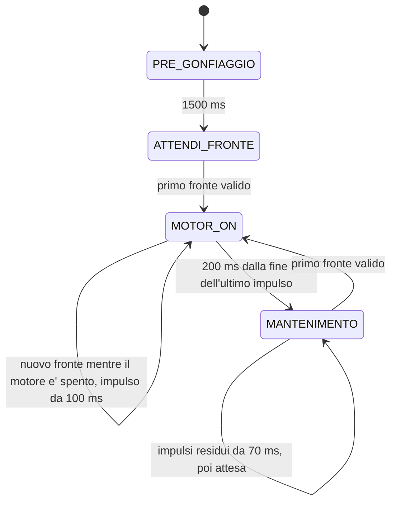

# Freno pneumatico — Arduino Nano Every

Il firmware e' in `sketchbook/FrenoPneumatico/FrenoPneumatico.ino`.
Ogni stato ha una parte **ONCE**, eseguita all'ingresso, e una parte
**ALWAYS**, eseguita a ogni loop. L'ISR serve soltanto a leggere e filtrare
l'encoder e a copiare il suo livello grezzo sul debug PE1. Tutte le
transizioni, i timer e le accensioni del motore sono nel main loop.

## Sequenza



| Stato | ONCE | ALWAYS |
| --- | --- | --- |
| `PRE_GONFIAGGIO` | Ripristina la prova e accende il motore | Dopo 1500 ms passa direttamente a `ATTENDI_FRONTE` |
| `ATTENDI_FRONTE` | Spegne il motore | Al primo fronte valido passa a `MOTOR_ON` |
| `MOTOR_ON` | Accende il primo impulso; memorizza Dt e fronti; azzera il conteggio del tempo acceso | Termina ciascun impulso dopo 100 ms; un nuovo fronte mentre e' spento genera un altro impulso; dopo 200 ms dall'ultimo spegnimento corregge la richiesta e passa al mantenimento |
| `MANTENIMENTO` | Prepara il progressivo degli impulsi residui | Genera le accensioni da 70 ms; al primo fronte torna a `MOTOR_ON`; dopo l'ultima accensione rimane qui in attesa |
| `FERMO` | Spegne il motore | Attende il comando `a` |

Le transizioni eseguono subito il ONCE del nuovo stato nello stesso loop.
Lo stato `ATTENDI_ARRESTO` e' stato eliminato. I fronti durante il
pregonfiaggio sono contati, senza avviare il bloccaggio o essere accodati.
Anche un fronte osservato nel loop che termina il pregonfiaggio viene
consumato: serve un nuovo fronte dopo l'ingresso in `ATTENDI_FRONTE`.

## Bloccaggio con piu' impulsi

Entrando in `MOTOR_ON`, il main loop accende il motore e inizia un nuovo
episodio. Registra l'istante iniziale, il periodo `Dt` dal precedente
inizio di `MOTOR_ON` e il numero di fronti sullo stesso intervallo.
Questi campioni restano invariati durante i successivi impulsi di bloccaggio.

Ogni accensione dura `IMPULSO_BLOCCAGGIO_MS`, inizialmente **100 ms**.
Alla sua fine il motore viene spento e si retriggera `MOTOR_ON_TIMEOUT_MS`,
inizialmente **200 ms**. Il timeout parte dalla fine dell'accensione,
non dal fronte che l'aveva avviata.

- Un fronte durante l'accensione viene contato, ma non prolunga l'impulso,
  non retriggera il timeout e non accoda altre accensioni.
- Un nuovo fronte dopo lo spegnimento accende subito un altro impulso
  nel main loop, senza uscire da `MOTOR_ON`.
- Un fronte osservato nello stesso loop che termina un impulso viene
  consumato mentre il motore e' ancora acceso; serve un fronte successivo.
- Un fronte mentre il motore e' spento ha precedenza sulla scadenza del
  timeout e avvia un altro impulso, anche a 200 ms esatti.

Alla fine di ogni impulso riparte l'attesa di 200 ms. Quando scade senza
un nuovo fronte, il controllo considera il freno fermo, calcola la
correzione **una sola volta** e passa a `MANTENIMENTO`.
Il numero di impulsi non e' prefissato: per esempio, possono servire
2, 3 o 4 accensioni da 100 ms secondo il carico.

`tempoBloccaggioMs` somma tutte le durate effettive di accensione di questo
episodio. Se il loop spegne il motore in ritardo, include anche il tempo
aggiuntivo. Il conteggio usa sottrazioni unsigned per il rollover e una
somma saturata a `UINT32_MAX`, senza overflow.

## Correzione e residuo

La correzione mantiene la regola proporzionale precedente, applicata alla
fine del bloccaggio anziche' alla prima accensione:

```text
Dt = inizio MOTOR_ON attuale - inizio MOTOR_ON precedente
n = contatore all'inizio attuale - contatore all'inizio precedente
Kp = KP_PER_MILLE / 1000 = 1
correzione = arrotonda(Kp * (600 ms - Dt / n))
richiesta = limita(richiesta precedente + correzione, 170 ms, 2000 ms)
```

Tempo e contatore sono campionati all'ingresso e descrivono lo stesso
intervallo. I fronti dei successivi impulsi di bloccaggio continuano a
incrementare il contatore, entrando nell'intervallo della prossima prova.
I fronti del pregonfiaggio non influenzano la prima correzione.
Al primo episodio non c'e' un intervallo precedente: `Dt`, `Fr` e `Corr`
sono zero e si conserva la richiesta iniziale.

Una media inferiore a 600 ms per fronte aumenta la richiesta; una media
superiore la diminuisce. Il calcolo intero usa 64 bit, conserva la frazione
fino alla fine e arrotonda al millisecondo piu' vicino, simmetricamente nei
due versi. Con `n = 0` non si applica correzione.
`Corr` nel log e' la variazione effettiva dopo i limiti della richiesta.

La richiesta iniziale e minima e' **170 ms**, calcolata come
`IMPULSO_BLOCCAGGIO_MS + IMPULSO_MANTENIMENTO_MS`; il massimo resta
**2000 ms**. La correzione modifica questo totale richiesto e non la durata
fissa di ciascun impulso di bloccaggio.

```text
residuo = max(richiesta corretta - tempoBloccaggioMs, 0)
numero mantenimenti = floor(residuo / IMPULSO_MANTENIMENTO_MS)
```

Si sottraggono tutte le accensioni di bloccaggio, non soltanto la prima.
Se hanno gia' consumato la richiesta, o il residuo e' inferiore a 70 ms,
non si genera mantenimento: lo stato rimane comunque in attesa del fronte.
Il controllo puo' eseguire altri impulsi di bloccaggio anche se ha gia'
consumato il totale richiesto; la fine di `MOTOR_ON` dipende dal timeout.
Non vengono forzati mantenimenti che superano il residuo.

## Mantenimento

Ogni accensione dura **70 ms**, con il parametro `IMPULSO_MANTENIMENTO_MS`.
Gli avvii sono distribuiti sul `Dt` misurato; soltanto al primo episodio,
senza Dt, si usa `MS_PER_FRONTE = 600 ms`:

```text
periodo = Dt se Dt > 0, altrimenti MS_PER_FRONTE
intervallo = periodo / (numero mantenimenti + 1)
avvio programmato k = inizio MOTOR_ON + floor(k * periodo / (numero mantenimenti + 1))
k = 1, 2, ..., numero mantenimenti
```

Se il bloccaggio e il timeout hanno gia' superato una scadenza, il primo
mantenimento parte quando il controllo entra nello stato. I successivi
conservano almeno l'intervallo calcolato fra gli avvii effettivi, evitando
una raffica per recuperare scadenze arretrate. Non c'e' una distanza minima
fissa impostata. Se l'intervallo e' piu' corto dei 70 ms di accensione,
si aspetta lo spegnimento e un loop successivo prima di riaccendere.
Il prodotto che calcola le scadenze usa 64 bit.

In `MANTENIMENTO` l'attesa del fronte e' sempre attiva, durante le pause,
durante un'accensione e dopo l'ultimo mantenimento. Un nuovo fronte ha
precedenza sulle scadenze, annulla gli impulsi residui e torna subito a
`MOTOR_ON` nel main loop. Se il motore era gia' acceso, rimane HIGH senza
una commutazione LOW; il nuovo impulso di bloccaggio dura 100 ms
dall'ingresso in `MOTOR_ON`.

Esempio con richiesta di 600 ms al primo episodio: tre bloccaggi da
100 ms consumano 300 ms. Restano 300 ms, quindi quattro mantenimenti da
70 ms, per un totale effettivo di **580 ms**; il resto di 20 ms non viene
recuperato. Con bloccaggi a `t=0`, `140` e `280`, l'ultimo termina a
`t=380` e il timeout scade a `t=580`. I mantenimenti partono a
`t=580`, `700`, `820`, `940`: intervalli regolari di 120 ms.

## Parametri

| Parametro | Valore iniziale | Significato |
| --- | --- | --- |
| `PRE_GONFIAGGIO_MS` | 1500 | Accensione iniziale |
| `MOTOR_ON_TIMEOUT_MS` | 200 | Attesa dalla fine dell'ultimo bloccaggio |
| `IMPULSO_BLOCCAGGIO_MS` | 100 | Durata di ciascun impulso di bloccaggio |
| `IMPULSO_MANTENIMENTO_MS` | 70 | Durata di ciascun mantenimento |
| `MS_PER_FRONTE` | 600 | Obiettivo per fronte e primo periodo di distribuzione |
| `KP_PER_MILLE` | 1000 | Guadagno proporzionale Kp = 1 |
| `RICHIESTA_MINIMA_MS` | 170 | Bloccaggio + mantenimento, calcolato dalle due durate |
| `RICHIESTA_INIZIALE_MS` | 170 | Totale richiesto al primo episodio |
| `RICHIESTA_MASSIMA_MS` | 2000 | Massimo del totale richiesto |
| `ENCODER_HOLDOFF_US` | 2000 | Tempo minimo fra fronti encoder accettati |

## Collegamenti e ISR

| Segnale | Pin | Configurazione |
| --- | --- | --- |
| Preimpostazione | D11 | HIGH |
| Preimpostazione | D6 | HIGH |
| Preimpostazione | D4 | LOW |
| Comando pompa | D3 | HIGH acceso, LOW spento |
| Encoder | D14 / A0 | INPUT, senza pull-up, interrupt CHANGE |
| Debug encoder | D12 / PE1 | OUTPUT, copia del livello grezzo encoder |
| Ingresso aggiuntivo | PD6 | INPUT, buffer digitale attivo, senza pull-up o interrupt |
| Ingresso aggiuntivo | PA6 | INPUT, buffer digitale attivo, senza pull-up o interrupt |

In `setup()` ogni pin Arduino viene configurato con `pinMode()` prima di
`digitalWrite()`, come richiesto dal core megaAVR per D11 e D6 HIGH.
PD6 e PA6 vengono configurati direttamente con `DIRCLR = PIN6_bm` e
`PIN6CTRL = 0`, anche se non sono mappati dalla variante Arduino Nano Every.

L'ISR copia subito A0 su PE1, prima del filtro: il debug mostra anche i
rimbalzi. Il primo fronte e' accettato, anche a `micros() = 0`; dopo un
fronte valido quelli a meno di 2 ms vengono scartati. A 2 ms esatti il
nuovo fronte e' valido. I rimbalzi scartati non prolungano il holdoff.
Si contano salita e discesa: un impulso alto/basso vale due fronti se
entrambi passano il filtro. L'encoder deve fornire livelli definiti e
compatibili, con massa comune alla scheda.

L'ISR incrementa soltanto `encoderTotale` dopo il filtro: non conosce lo
stato della macchina, non imposta richieste motore e non esegue log.
`leggiEncoder()` usa `ATOMIC_BLOCK(ATOMIC_RESTORESTATE)` per leggere insieme
i 32 bit del contatore sul microcontrollore a 8 bit, ripristinando poi lo
stato degli interrupt. La macchina a stati rileva i fronti confrontando
questo campione con quello gia' letto nel main loop.

## Log e comandi seriali

Monitor seriale a **115200 baud**. All'alimentazione o reset si stampa
`Avvio freno`. Con o senza terminazione di riga:

| Comando | Effetto |
| --- | --- |
| `s` | Passa a `FERMO` e spegne il motore nello stesso loop |
| `a` | Da `FERMO`, riparte con pregonfiaggio e richiesta iniziale |

`a` durante una prova attiva e' ignorato. Una nuova prova cancella i
campioni della precedente, senza ristampare `Avvio freno`. La lettura dei
comandi e' limitata a otto caratteri per loop. Non si usa `delay()`.

Il log dell'esempio da 600 ms e tre bloccaggi e':

```text
B:1 Imp:100 t:         0 d:         0
B:2 Imp:100 t:       140 d:       140
B:3 Imp:100 t:       280 d:       140
Corr:   +0 Dt:         0 Fr:    0 Req: 600 On: 300 M:4
M:1/4 t:       580 d:       300
M:2/4 t:       700 d:       120
M:3/4 t:       820 d:       120
M:4/4 t:       940 d:       120
```

- `B` numera le accensioni di bloccaggio. `Imp` e' la loro durata impostata.
- `Corr`, `Dt`, `Fr`, `Req`, `On`, `M` compaiono una sola volta alla fine
  di `MOTOR_ON`: correzione effettiva, intervallo e fronti congelati,
  richiesta corretta, somma del tempo acceso per il bloccaggio e numero
  di mantenimenti residui.
- `M:1/4` numera soltanto i mantenimenti, senza includere i bloccaggi.
- `t` riparte da zero al primo bloccaggio di ogni nuovo episodio.
- `d` misura la distanza fra avvii fisici successivi; per il primo
  bloccaggio vale zero e per il primo mantenimento si riferisce
  all'ultimo bloccaggio.

Ogni riga viene inviata soltanto se entra interamente nella UART. Con
spazio insufficiente, o campi molto grandi che superano il buffer,
viene saltata senza attese. Timer e distanze restano corretti anche se una
riga non viene stampata. Tutte le stampe sono fuori dall'ISR.

## Struttura e verifiche

```text
GIN/
├── README.md
├── sketchbook/
│   └── FrenoPneumatico/
│       └── FrenoPneumatico.ino
└── tests/
    ├── controller_test.cpp
    └── mock/
        ├── Arduino.h
        └── util/atomic.h
```

Usare `GIN` come repository locale e `GIN/sketchbook` come posizione
sketchbook nell'IDE Arduino. Il nome del file e quello della cartella
coincidono. Installare **Arduino megaAVR Boards**, scegliere **Arduino
Nano Every** e **Registers emulation: None (ATMEGA4809)**.

```sh
arduino-cli compile --fqbn arduino:megaavr:nona4809:mode=off sketchbook/FrenoPneumatico
```

Nel cloud si usa `/workspace/.tools/arduino/compile-nano-every.sh`.
Le verifiche comprendono anche la compilazione con `build.mcu=atmega3209`.
La toolchain cloud e' Arduino CLI 1.4.1, megaAVR 1.8.8, API 1.3.1 e AVR GCC
Debian 14.2.0, diverso dal compilatore del pacchetto Arduino standard.
Il caricamento USB non e' verificato.

I **33 gruppi di test** simulati coprono GPIO, pregonfiaggio senza attesa
arresto, debug/holdoff, ISR senza comandi motore, ONCE/ALWAYS, impulsi da
100 ms, due-quattro bloccaggi, fronti durante HIGH senza coda, timeout
retriggerato allo spegnimento, fronti sulle scadenze, correzione differita,
campioni invariati, residuo dopo tutte le accensioni, assenza di mantenimento
con richiesta consumata, tempo acceso effettivo con loop in ritardo,
interruzione del mantenimento, correzione proporzionale e arrotondamento,
limiti e richiesta da 2000 ms con 27 mantenimenti, intervalli frazionari,
rollover di tempo e contatore, prodotti a 64 bit, saturazione del tempo
acceso, stop/riavvio, seriale congestionata e righe saltate.

```sh
set -e
mkdir -p /tmp/gin-tests
g++ -std=c++11 -Wall -Wextra -Werror -pedantic \
  -fsanitize=address,undefined -I tests/mock tests/controller_test.cpp \
  -o /tmp/gin-tests/controller_test
ASAN_OPTIONS=detect_leaks=0 /tmp/gin-tests/controller_test
```

I file `tests/mock/Arduino.h` e `tests/mock/util/atomic.h` servono soltanto
alla simulazione sul PC: non vanno copiati nello sketch e non simulano la
concorrenza reale degli ISR. AddressSanitizer e UndefinedBehaviorSanitizer
rimangono attivi; `detect_leaks=0` evita i limiti di LeakSanitizer sotto
`ptrace`. La risposta pneumatica e l'arresto reale vanno verificati sul prototipo.
