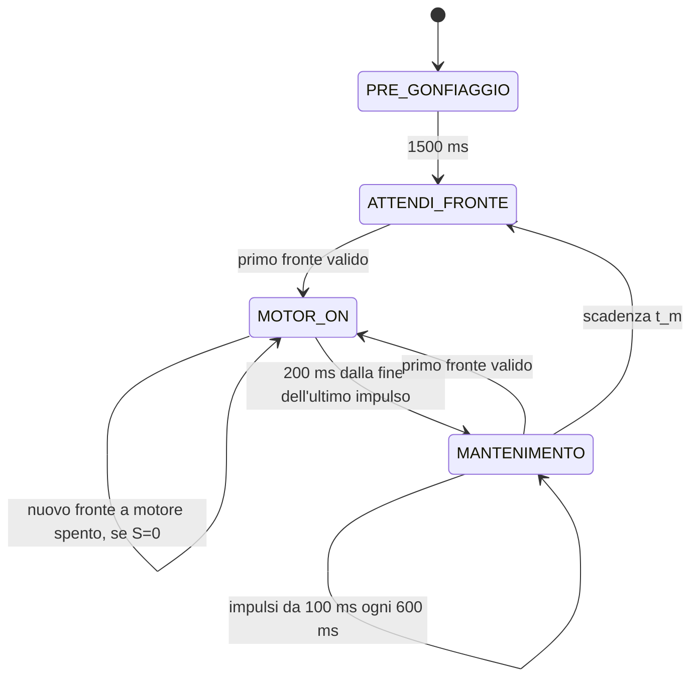

# Freno pneumatico — Arduino Nano Every

Il firmware e' in `sketchbook/FrenoPneumatico/FrenoPneumatico.ino`.
Ogni stato ha una parte **ONCE**, eseguita all'ingresso, e una parte
**ALWAYS**, eseguita a ogni loop. L'ISR legge e filtra l'encoder e copia il
livello grezzo sul debug PE1. Transizioni, timer e uscite motore sono nel main loop.

## Sequenza



| Stato | ONCE | ALWAYS |
| --- | --- | --- |
| `PRE_GONFIAGGIO` | Azzera campioni e correzione; accende il motore | Dopo 1500 ms passa direttamente a `ATTENDI_FRONTE` |
| `ATTENDI_FRONTE` | Spegne il motore | Al primo fronte valido passa a `MOTOR_ON` |
| `MOTOR_ON` | Accende il primo impulso; aggiorna Dt e t_corr; sceglie la modalita' S e inizia il nuovo conteggio n | Termina gli impulsi dopo 150 ms; in S=0 un fronte a motore spento genera un altro impulso; in S=1 esegue soltanto il primo; dopo 200 ms dall'ultimo spegnimento passa al mantenimento |
| `MANTENIMENTO` | Calcola t_m dal nuovo n e dalla durata completa di MOTOR_ON | Genera impulsi da 100 ms ogni 600 ms; al primo fronte torna a `MOTOR_ON`; a fine t_m passa a `ATTENDI_FRONTE` |
| `FERMO` | Spegne il motore | Attende il comando `a` |

Ogni transizione esegue subito il ONCE del nuovo stato nello stesso loop.
Non c'e' uno stato `ATTENDI_ARRESTO`. I fronti del pregonfiaggio vengono
consumati senza avviare o accodare bloccaggi. Anche un fronte osservato
nel loop che termina il pregonfiaggio viene consumato: serve un nuovo
fronte dopo l'ingresso in `ATTENDI_FRONTE`.

## Bloccaggio normale e singolo

Ogni accensione in `MOTOR_ON` dura `IMPULSO_BLOCCAGGIO_MS`, **150 ms**.
Alla fine il motore si spegne e riparte `MOTOR_ON_TIMEOUT_MS`, **200 ms**,
misurato dallo spegnimento effettivo. In modalita' normale (`S:0`):

- Un fronte durante HIGH viene contato, senza prolungare l'impulso,
  retriggerare il timeout o accodare altre accensioni.
- Un nuovo fronte dopo lo spegnimento accende un altro impulso nel main
  loop, senza uscire dallo stato o ricalcolare Dt e t_corr.
- Un fronte osservato nel loop che termina un impulso viene consumato
  mentre il motore e' ancora acceso; serve un fronte successivo.
- Un fronte osservato a motore spento ha precedenza sul timeout,
  anche a 200 ms esatti dall'ultimo spegnimento.

Il numero di bloccaggi dipende dai fronti: per esempio possono servire
2, 3 o 4 impulsi. Quando scadono 200 ms senza un nuovo fronte a motore
spento, il controllo considera il freno arrestato e passa a `MANTENIMENTO`.
La modalita' normale consente cosi' piu' accensioni per arrestare il freno.

### Recupero della correzione positiva

All'ingresso in `MOTOR_ON`, dopo aver aggiornato t_corr, il controllo
sceglie il bloccaggio singolo (`S:1`) se entrambe le condizioni sono vere:

```text
t_corr > 0
nel ciclo precedente il numero nominale di mantenimenti era zero
```

Questo include finestre nulle e finestre inferiori ai 100 ms necessari
per un mantenimento completo. Il primo ciclo parte in modalita' normale.
La scelta resta fissata per tutto lo stato, anche se i nuovi fronti
aumentano n e rendono nuovamente possibile il mantenimento.

In S=1 si esegue un solo bloccaggio da 150 ms. I fronti durante HIGH e
durante i successivi 200 ms vengono tutti contati, senza avviare altre
accensioni o spostare il timeout. Lo stato termina 200 ms dopo lo
spegnimento del primo impulso: nominalmente 350 ms dall'ingresso,
anche se continuano ad arrivare fronti.

Anche un fronte osservato nel loop della scadenza viene contato e
consumato da MOTOR_ON; non viene inoltrato al nuovo stato. Un nuovo
fronte dopo l'uscita puo' invece riavviare subito MOTOR_ON da mantenimento
o attesa, secondo la logica consueta.

Il timeout in S=1 non conferma necessariamente l'arresto: serve a
ridurre la frenata lasciando contare piu' fronti. Al prossimo ingresso,
un n precedente maggiore aumenta il termine sottratto nella correzione,
favorendo il recupero di t_corr positiva. Quando t_corr non e' piu'
positiva, oppure il ciclo precedente prevede di nuovo mantenimenti,
il nuovo MOTOR_ON torna in S=0 e puo' ripetere i bloccaggi.

Esempio simulato: con Corr=1400 ms e nessun mantenimento precedente,
il bloccaggio singolo conta tre fronti in 350 ms. Al successivo ingresso
dopo Dt=600 ms, la correzione diventa 1400+600-3*600=200 ms.
Con altri tre fronti e una durata MOTOR_ON di 350 ms, la nuova finestra
e' 1800-350-200=1250 ms e prevede due mantenimenti. Il ciclo successivo
puo' quindi riprendere i bloccaggi multipli anche se Corr resta positiva.

## Conteggi e correzione accumulata

Il fronte che avvia `MOTOR_ON` appartiene al **nuovo** ciclo. `frontiMotorOn`
conta questo fronte e tutti quelli successivi osservati nello stato,
compresi quelli durante HIGH. Se piu' fronti sono gia' arrivati prima
che il main loop reagisca, sono tutti assegnati al nuovo ciclo, ma
avviano un solo impulso. Il conteggio viene congelato uscendo da `MOTOR_ON`.

Il primo fronte in mantenimento o attesa inizia il prossimo ciclo:
non viene aggiunto al precedente. In questo modo ogni fronte valido
appartiene a un solo ciclo. All'ingresso di `MOTOR_ON`:

```text
Dt = inizio MOTOR_ON attuale - inizio MOTOR_ON precedente
n_precedente = fronti contati nel MOTOR_ON precedente
t_corr += Dt - n_precedente * MS_PER_FRONTE
n_attuale = fronti iniziali del nuovo MOTOR_ON
```

La correzione **si accumula**, come scelto per compensare il ritardo di
sblocco. Al primo ciclo non esiste un Dt precedente: `Dt`, `Np` e `Corr`
sono zero. I fronti del pregonfiaggio non entrano nel conteggio.
Durante i successivi bloccaggi e il mantenimento, t_corr resta invariata.

Se il ciclo precedente e' troppo lento, l'errore e' positivo: aumenta
t_corr e accorcia la prossima finestra. Se e' troppo rapido, l'errore e'
negativo: diminuisce t_corr e allunga la finestra. Si conserva il segno;
una correzione negativa e' ammessa.

La formula diretta `t_corr = Dt - n_precedente * MS_PER_FRONTE` sarebbe
un errore di cadenza, anziche' una stima persistente del ritardo. Nel modello
ideale con ritardo costante L e una finestra senza saturazioni:

```text
Dt = n_precedente * MS_PER_FRONTE - t_corr_precedente + L
t_corr_nuova = t_corr_precedente + Dt - n_precedente * MS_PER_FRONTE = L
```

La forma accumulata conserva quindi la compensazione quando il successivo
errore e' zero; la forma diretta la azzererebbe, potendo alternare fra 0 e L.

## Finestra di mantenimento

Alla fine di `MOTOR_ON`, il controllo calcola:

```text
durata_motor_on = ingresso MANTENIMENTO - ingresso MOTOR_ON
t_m = max(n_attuale * MS_PER_FRONTE - durata_motor_on - t_corr, 0)
```

**durata_motor_on e' l'intero tempo nello stato:** comprende tutte le
accensioni, le pause fra esse e il timeout finale di 200 ms.
Sottrarre soltanto i tempi HIGH lascerebbe fuori queste attese dal periodo
che si vuole regolare. `tempoBloccaggioMs` conserva la somma HIGH come dato
diagnostico, ma non viene usata nella formula.

`t_m` misura una finestra temporale dal momento d'ingresso in
`MANTENIMENTO`; non e' un budget di motore acceso. Il primo mantenimento
parte all'ingresso, se rimangono almeno 100 ms. Gli altri partono ogni
**600 ms fra avvii**, quindi nominalmente 100 ms HIGH e 500 ms LOW.
L'intervallo e' parametrico e indipendente da `MS_PER_FRONTE`.

```text
numero nominale = 0, se t_m < IMPULSO_MANTENIMENTO_MS
altrimenti = 1 + floor((t_m - IMPULSO_MANTENIMENTO_MS) / INTERVALLO_MANTENIMENTO_MS)
```

Si avviano soltanto impulsi completi che possono terminare entro t_m.
Se alla fine rimane meno di 100 ms, non si allunga o tronca un altro impulso.
Dopo l'ultima accensione si rimane in `MANTENIMENTO` fino alla scadenza
della finestra; poi si spegne e si passa a `ATTENDI_FRONTE`, senza ulteriori
accensioni automatiche. Con t_m negativo o zero si passa subito all'attesa.

Un fronte encoder ha precedenza su tutte le scadenze di mantenimento:
interrompe la sequenza e riavvia subito `MOTOR_ON` nel main loop, anche
durante HIGH o nel loop che raggiunge t_m. Se il motore e' gia' acceso,
resta HIGH senza una commutazione LOW; il nuovo bloccaggio dura 150 ms
dall'ingresso. Non c'e' una distanza minima fra questi riavvii.

Con un loop in ritardo, gli avvii effettivi mantengono almeno 600 ms di
distanza: non si recuperano gli impulsi persi con una raffica. La scadenza
di t_m resta quella iniziale, quindi possono essere eseguiti meno impulsi
del numero nominale. Spegnimenti e reazioni ai fronti avvengono al primo
loop che li osserva; la macchina a stati non usa interrupt per i timer.

Esempio al primo ciclo, con tre fronti che avviano bloccaggi a t=0, 170,
340 ms: i tre impulsi da 150 ms terminano a t=490; il timeout termina a
t=690. Con n=3 e t_corr=0, t_m=1800-690=1110 ms. I mantenimenti da 100 ms
partono a t=690 e t=1290; a t=1800 il controllo passa a `ATTENDI_FRONTE`.
La somma delle accensioni di bloccaggio e' 450 ms, ma il tempo da sottrarre
e' 690 ms.

## Coerenza e limiti del controllo

La correzione accumulata regola la cadenza media: se non raggiunge i limiti,
la somma degli errori di ciclo resta contenuta dalla correzione stessa.
Il mantenimento introduce una quantizzazione: aggiungere o togliere un
impulso sposta l'ultimo spegnimento di 600 ms. Sono quindi possibili cicli
alternati intorno all'obiettivo, anche con ritardo di sblocco costante.
`t_corr` compensa l'effetto complessivo misurato; il ritardo fisico dal
vero ultimo spegnimento non coincide necessariamente con il tempo dalla
fine della finestra, che puo' contenere una pausa finale.

L'obiettivo e' **600 ms per fronte accettato**, non per impulso alto/basso:
l'interrupt `CHANGE` conta entrambi i fronti, se superano il filtro.
Per mantenere il freno bloccato, la pausa di 500 ms deve essere compatibile
con il tempo di rilascio del sistema; se si sblocca prima, il fronte
interrompe subito il mantenimento come previsto.

Con t_m=0 non e' possibile abbreviare ulteriormente il ciclo tramite
mantenimento. Il bloccaggio singolo riduce allora le accensioni ripetute
quando la correzione resta positiva e mancano i mantenimenti. L'accumulo
di t_corr rimane attivo; il recupero dipende dai fronti effettivamente
ottenuti, senza azzeramenti artificiali della correzione. Se anche un
solo impulso, il timeout e il rilascio richiedono piu' del tempo obiettivo,
la correzione puo' ancora crescere: la possibilita' di regolare la cadenza
dipende dalla risposta fisica del sistema.

I prodotti e le differenze usano 64 bit con segno. La finestra viene
limitata a `0..UINT32_MAX` ms, la correzione a `-UINT32_MAX..UINT32_MAX` ms,
per restare nel campo dei timer. Non c'e' piu' il limite della vecchia
richiesta di 2000 ms: i parametri di richiesta e Kp sono stati eliminati.
I timer funzionano attraverso il rollover con intervalli inferiori a
un giro completo di `millis()`; `encoderTotale` puo' attraversare il
rollover nel conteggio di un ciclo. La somma diagnostica dei tempi HIGH
satura a `UINT32_MAX`.

## Parametri

| Parametro | Valore iniziale | Significato |
| --- | --- | --- |
| `PRE_GONFIAGGIO_MS` | 1500 | Accensione iniziale |
| `MOTOR_ON_TIMEOUT_MS` | 200 | Attesa dalla fine dell'ultimo bloccaggio |
| `IMPULSO_BLOCCAGGIO_MS` | 150 | Durata di ciascun bloccaggio |
| `IMPULSO_MANTENIMENTO_MS` | 100 | Durata di ciascun mantenimento |
| `INTERVALLO_MANTENIMENTO_MS` | 600 | Distanza fra avvii di mantenimento |
| `MS_PER_FRONTE` | 600 | Cadenza media obiettivo per fronte valido |
| `ENCODER_HOLDOFF_US` | 2000 | Tempo minimo fra fronti accettati |

## Collegamenti e ISR

| Segnale | Pin | Configurazione |
| --- | --- | --- |
| Preimpostazione | D11 | HIGH |
| Preimpostazione | D6 | HIGH |
| Preimpostazione | D4 | LOW |
| Comando pompa | D3 | HIGH acceso, LOW spento |
| Encoder | D14 / A0 | INPUT, senza pull-up, interrupt CHANGE |
| Debug encoder | D12 / PE1 | OUTPUT, copia del livello grezzo encoder |
| Ingresso aggiuntivo | PD6 | INPUT, buffer digitale attivo, senza pull-up o interrupt |
| Ingresso aggiuntivo | PA6 | INPUT, buffer digitale attivo, senza pull-up o interrupt |

In `setup()` ogni pin Arduino viene configurato con `pinMode()` prima di
`digitalWrite()`, come richiesto dal core megaAVR per D11 e D6 HIGH.
PD6 e PA6 vengono configurati direttamente con `DIRCLR = PIN6_bm` e
`PIN6CTRL = 0`, anche se non sono mappati dalla variante Arduino Nano Every.

L'ISR copia subito A0 su PE1, prima del filtro: il debug mostra anche i
rimbalzi. Il primo fronte e' accettato, anche a `micros() = 0`; dopo un
fronte valido quelli a meno di 2 ms vengono scartati. A 2 ms esatti il
nuovo fronte e' valido. I rimbalzi scartati non prolungano il holdoff.
Si contano salita e discesa: un impulso alto/basso vale due fronti se
entrambi passano il filtro. L'encoder deve fornire livelli definiti e
compatibili, con massa comune alla scheda.

L'ISR incrementa soltanto `encoderTotale` dopo il filtro: non conosce lo
stato della macchina, non imposta richieste motore e non esegue log.
`leggiEncoder()` usa `ATOMIC_BLOCK(ATOMIC_RESTORESTATE)` per leggere insieme
i 32 bit del contatore sul microcontrollore a 8 bit, ripristinando poi lo
stato degli interrupt. La macchina a stati rileva i fronti confrontando
questo campione con quello gia' letto nel main loop.

## Log e comandi seriali

Monitor seriale a **115200 baud**. All'alimentazione o reset si stampa
`Avvio freno`. Con o senza terminazione di riga:

| Comando | Effetto |
| --- | --- |
| `s` | Passa a `FERMO` e spegne il motore nello stesso loop |
| `a` | Da `FERMO`, riparte con pregonfiaggio e correzione azzerata |

`a` durante una prova attiva e' ignorato. Una nuova prova cancella i
campioni della precedente, senza ristampare `Avvio freno`. La lettura dei
comandi e' limitata a otto caratteri per loop. Non si usa `delay()`.

Il log dell'esempio con tre bloccaggi e n=3 e':

```text
B:1 Imp:150 t:         0 d:         0
Dt:         0 Np:    0 Corr:+0 S:0
B:2 Imp:150 t:       170 d:       170
B:3 Imp:150 t:       340 d:       170
Fr:    3 On:   690 Tm:  1110 M:2
M:1/2 t:       690 d:       350
M:2/2 t:      1290 d:       600
```

- `B` numera i bloccaggi; `Imp` e' la durata parametrica.
- `Dt`, `Np`, `Corr`, `S` compaiono soltanto all'ingresso in `MOTOR_ON`:
  intervallo dal precedente ingresso, n precedente e correzione accumulata.
  `S:1` indica bloccaggio singolo, `S:0` bloccaggi multipli consentiti.
- `Fr`, `On`, `Tm`, `M` compaiono al termine del bloccaggio: n attuale,
  tempo completo in MOTOR_ON, finestra t_m e numero nominale di mantenimenti.
- `M:1/2` numera i mantenimenti avviati, senza ripetere Dt o Corr.
- `t` riparte da zero al primo bloccaggio di ogni episodio.
- `d` misura la distanza fra avvii effettivi; al primo bloccaggio vale
  zero, al primo mantenimento si riferisce all'ultimo bloccaggio.

Ogni riga viene inviata soltanto se entra interamente nella UART. Con
spazio insufficiente, o campi molto grandi che superano il buffer,
viene saltata senza attese. Timer e distanze restano corretti anche se una
riga non viene stampata. Tutte le stampe sono fuori dall'ISR.

## Struttura e verifiche

```text
GIN/
├── README.md
├── sketchbook/
│   └── FrenoPneumatico/
│       └── FrenoPneumatico.ino
└── tests/
    ├── controller_test.cpp
    └── mock/
        ├── Arduino.h
        └── util/atomic.h
```

Usare `GIN` come repository locale e `GIN/sketchbook` come posizione
sketchbook nell'IDE Arduino. Il nome del file e quello della cartella
coincidono. Installare **Arduino megaAVR Boards**, scegliere **Arduino
Nano Every** e **Registers emulation: None (ATMEGA4809)**.

```sh
arduino-cli compile --fqbn arduino:megaavr:nona4809:mode=off sketchbook/FrenoPneumatico
```

Nel cloud si usa `/workspace/.tools/arduino/compile-nano-every.sh`.
Le verifiche comprendono anche la compilazione con `build.mcu=atmega3209`.
La toolchain cloud e' Arduino CLI 1.4.1, megaAVR 1.8.8, API 1.3.1 e AVR GCC
Debian 14.2.0, diverso dal compilatore del pacchetto Arduino standard.
Il caricamento USB non e' verificato.

I **40 gruppi di test** simulati coprono GPIO, pregonfiaggio diretto,
debug/holdoff, ISR senza comandi motore, ONCE/ALWAYS, bloccaggi da 150 ms,
due-quattro accensioni, fronti durante HIGH senza coda, timeout retriggerato
allo spegnimento, fronti sulle scadenze, separazione dei conteggi fra cicli,
correzione accumulata una sola volta, segno della correzione, tempo completo
nello stato, impulsi da 100 ms ogni 600 ms, finestre corte e negative,
interruzione del mantenimento, scadenza e attesa, loop in ritardo,
rollover di tempo e contatore, calcoli a 64 bit, limiti numerici,
stop/riavvio, seriale congestionata e log saltati. Le verifiche del
bloccaggio singolo coprono condizioni d'ingresso, conteggio durante HIGH
e LOW senza retrigger, fronte sulla scadenza, recupero della correzione
e ritorno ai bloccaggi multipli, stop/riavvio, seriale congestionata e
rollover di timer e contatore.

Un modello pneumatico semplificato, con quattro fronti per movimento e
sblocco 800 ms dopo l'ultimo spegnimento, simula 100 cicli e misura
**602 ms per fronte** in media rispetto all'obiettivo di 600 ms.
Questo verifica la regolazione discreta nel modello; non prova la
stabilita' o la risposta del prototipo reale.

```sh
set -e
mkdir -p /tmp/gin-tests
g++ -std=c++11 -Wall -Wextra -Werror -pedantic \
  -fsanitize=address,undefined -I tests/mock tests/controller_test.cpp \
  -o /tmp/gin-tests/controller_test
ASAN_OPTIONS=detect_leaks=0 /tmp/gin-tests/controller_test
```

I file `tests/mock/Arduino.h` e `tests/mock/util/atomic.h` servono soltanto
alla simulazione sul PC: non vanno copiati nello sketch e non simulano la
concorrenza reale degli ISR. AddressSanitizer e UndefinedBehaviorSanitizer
rimangono attivi; `detect_leaks=0` evita i limiti di LeakSanitizer sotto
`ptrace`. La risposta pneumatica e l'arresto reale vanno verificati sul prototipo.
